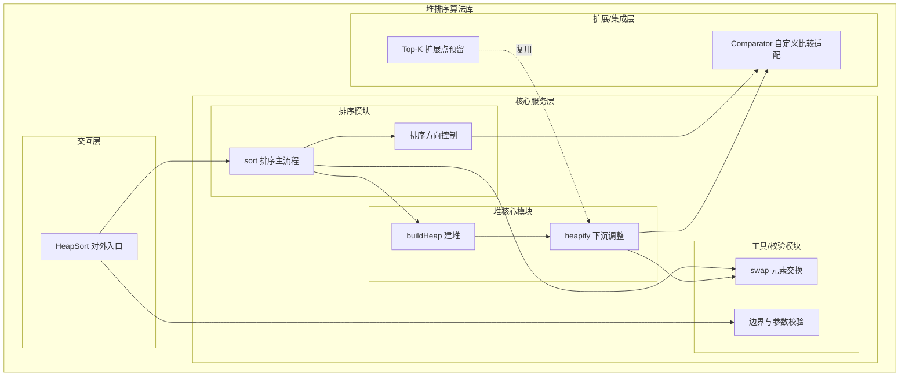
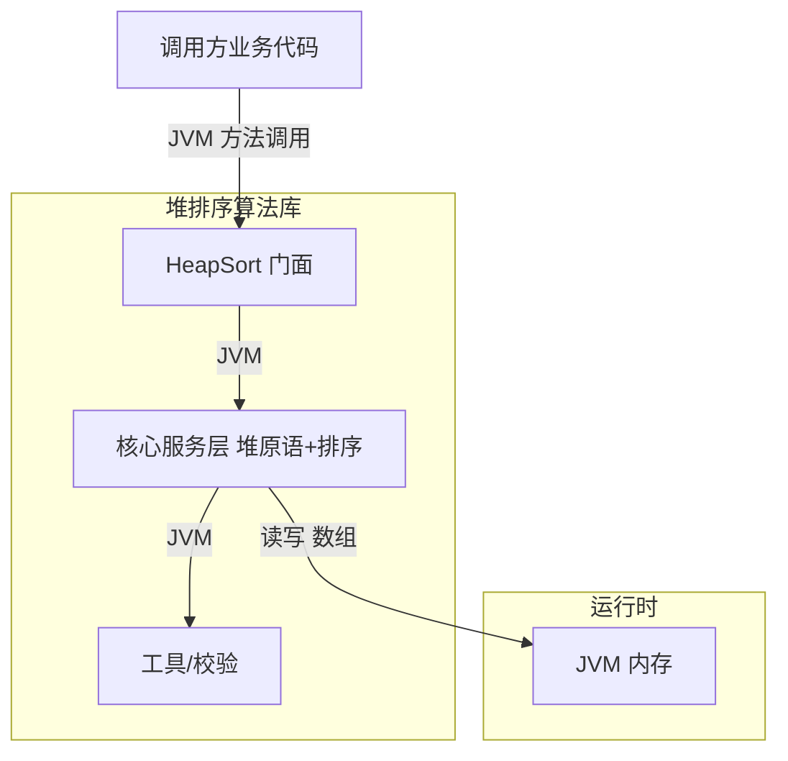
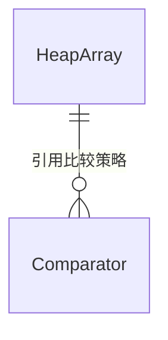
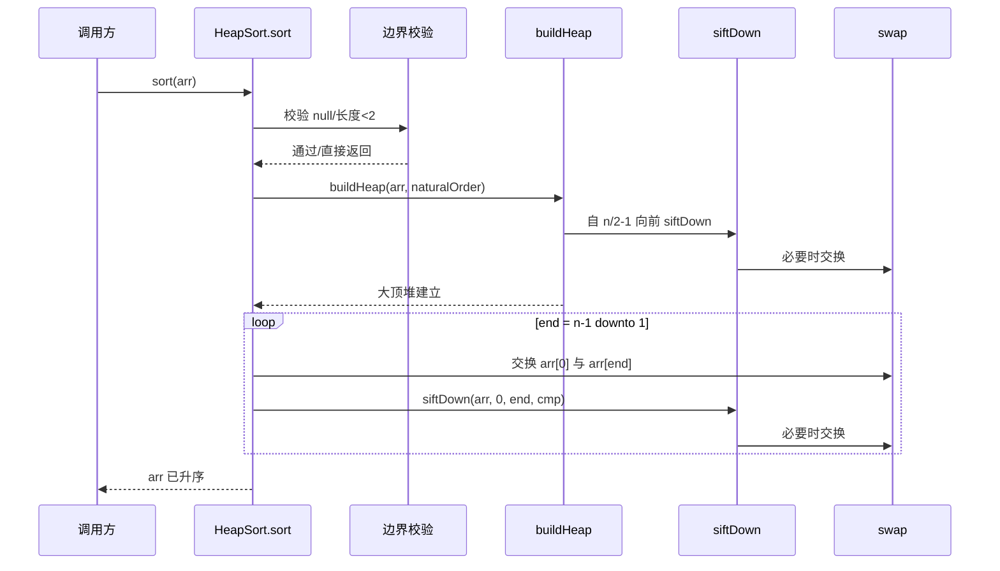
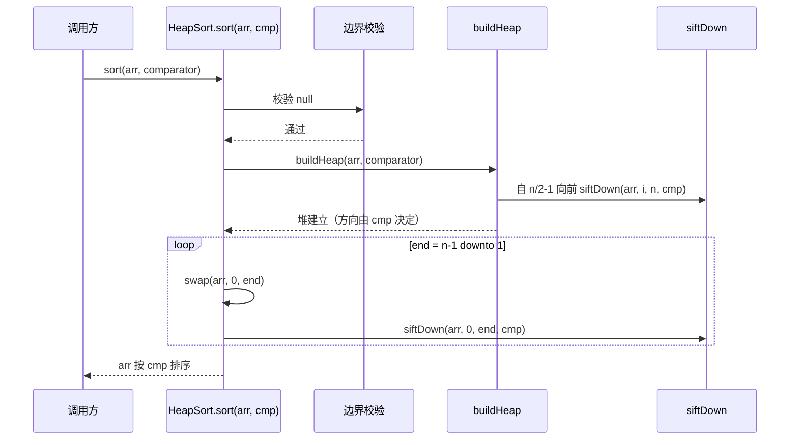

> **文档元信息**
>
> | 项目 | 内容 |
> |------|------|
> | 文档版本 | v1.0 |
> | 作者 | AI 系分引擎 |
> | 创建日期 | 2026-07-27 |
> | 需求来源 | 需求描述：实现一个堆排序 |
> | 评审状态 | 待评审 |

# 堆排序 系分设计

## 1. 需求与范围

### 背景与目标
堆排序（Heap Sort）是一种基于二叉堆数据结构的比较排序算法。本次需求要求实现一个堆排序算法，目标如下：

- 提供一个通用、正确、可复用的堆排序实现；
- 支持对任意可比较元素数组进行原地排序；
- 支持自定义排序方向（升序/降序）与自定义比较器；
- 具备清晰的模块边界，便于后续扩展（如 Top-K、外部排序复用堆原语）。

### 核心功能
1. **建堆（Build Heap）**：将输入数组原地调整为一个有效堆结构。
2. **堆排序（Heap Sort）**：通过反复"取出堆顶 + 下沉调整"，得到有序序列。
3. **堆调整原语（Heapify / Sift Down）**：维护堆性质的核心操作，可被建堆与排序阶段复用。
4. **排序方向控制**：升序采用大顶堆，降序采用小顶堆。

### 约束与非功能要求
- **时间复杂度**：建堆 O(n)，整体排序 O(n log n)，最坏/平均/最好均为 O(n log n)。
- **空间复杂度**：原地排序，额外空间 O(1)（不计递归则用迭代实现避免栈开销）。
- **稳定性**：堆排序本身不稳定，文档明确标注该特性。
- **语言/技术栈**：采用 Java 实现（JDK 8+），纯算法库，无外部中间件依赖。
- **线程安全**：堆排序操作传入数组本身，不做共享状态封装；并发场景由调用方加锁。
- **边界处理**：null 数组、空数组、单元素数组、含重复元素数组需正确处理。

### 排除范围
- 不实现外部排序（磁盘归并）；
- 不实现 Top-K 查询接口（仅作为后续扩展点预留，不在本次交付）；
- 不引入 Spring/数据库/缓存等中间件；
- 不提供 REST/OpenAPI 对外接口（本次为纯算法库交付）。

### 需求功能清单与优先级

| 编号 | 功能点 | 优先级 | PRD 原始描述/章节 | 备注 |
|------|--------|--------|-------------------|------|
| F01 | 堆调整原语 heapify（下沉） | P0 | 核心功能3 | 维护堆性质，建堆与排序复用 |
| F02 | 建堆 buildHeap | P0 | 核心功能1 | O(n) 建堆，自最后一个非叶节点向前 |
| F03 | 堆排序主流程 sort | P0 | 核心功能2 | 升序用大顶堆，原地排序 |
| F04 | 排序方向/自定义比较器支持 | P1 | 约束-排序方向 | 支持升降序与 Comparator |
| F05 | 边界与异常处理 | P0 | 约束-边界处理 | null/空/单元素/重复元素 |
| F06 | 单元测试与用例覆盖 | P0 | 非功能-质量 | 覆盖正常、边界、稳定性场景 |

### 假设与待确认项

| 编号 | 假设/待确认内容 | 当前假设 | 确认状态 |
|------|-----------------|----------|----------|
| A01 | 实现语言为 Java | 采用 Java（JDK8+），无业务框架依赖 | 已确认 |
| A02 | 排序对象为可比较元素数组 | 元素实现 Comparable 或提供 Comparator | 已确认 |
| A03 | 是否需要稳定排序 | 堆排序天然不稳定，文档标注，不做额外补偿 | 已确认 |
| A04 | 是否需要对外 API/REST 接口 | 本次仅算法库，不提供对外接口 | 已确认 |
| A05 | 数组元素是否允许 null | 默认不允许（比较会抛 NPE），由调用方保证 | 已确认 |

## 2. 架构与模块

### 功能架构

<!-- 层级说明：交互层对外暴露排序入口；核心服务层包含堆原语与排序主流程；扩展层支持自定义比较器与后续 Top-K 复用 -->

- 交互层说明：`HeapSort` 作为对外门面，提供 `sort` 重载方法（默认升序 / 自定义 Comparator）。
- 核心服务层说明：
  - 堆核心模块：`heapify` 维护堆性质（下沉），`buildHeap` 自最后一个非叶节点向前批量建堆。
  - 排序模块：`sort` 主流程负责"取堆顶 → 缩堆 → 下沉"循环；`Direction` 控制升降序对应的堆顶极值方向。
- 扩展/集成层说明：`ComparatorAdapter` 让 `heapify` 与具体比较逻辑解耦；`TopKExt` 为预留扩展点（本期不实现）。

**模块清单**

| 模块 | 职责 | 依赖 |
|------|------|------|
| HeapSort（交互层门面） | 对外提供排序入口与重载 | 排序模块、校验模块 |
| 堆核心模块 | 维护堆性质、批量建堆 | 工具/校验模块、ComparatorAdapter |
| 排序模块 | 排序主流程、方向控制 | 堆核心模块、工具/校验模块 |
| 工具/校验模块 | 元素交换、参数与边界校验 | 无 |
| Comparator 适配（扩展层） | 解耦比较逻辑，支持升降序 | 无 |

### 应用集成架构

<!-- 纯算法库无中间件/外部依赖，所有操作在 JVM 内存中完成 -->

**集成关系说明：**

| 调用方 | 被调用方 | 协议 | 接口类型 | 说明 |
|--------|----------|------|----------|------|
| 业务代码 | HeapSort | JVM 方法调用 | 静态方法 | 传入数组（与可选 Comparator）原地排序 |
| HeapSort | 堆核心模块 | JVM 方法调用 | 内部私有方法 | 建堆与 heapify |
| 堆核心模块 | Util | JVM 方法调用 | 内部私有方法 | swap 与边界校验 |

## 3. 数据模型与存储

### 实体清单

> 本次交付为纯算法库，不涉及持久化存储，无数据库实体。

| 实体名称 | 实体说明 | 所属模块 | 与其他实体的关系 |
|----------|----------|----------|-----------------|
| HeapArray（堆数组模型） | 用一维数组表示的完全二叉堆，索引 i 的父节点为 (i-1)/2，左子为 2i+1，右子为 2i+2 | 堆核心模块 | 排序模块在其上执行取顶-缩堆 |
| Comparator 比较器 | 抽象比较策略，决定大顶堆/小顶堆方向 | 扩展/集成层 | 被 HeapArray 的 heapify 引用 |

### 实体关系图

<!-- 堆数组在 JVM 内存中操作，不落库；Comparator 为策略对象，与堆数组为引用关系 -->

**模型说明：**
- 堆以一维数组就地表示完全二叉树，无需额外节点对象，空间 O(1)。
- 升序排序使用大顶堆（父 ≥ 子），降序排序使用小顶堆（父 ≤ 子），由 Comparator 决定。
- 数组下标关系（0 基下标）：
  - 父节点 parent(i) = (i-1)/2
  - 左子 left(i) = 2i+1
  - 右子 right(i) = 2i+2
- 最后一个非叶子节点索引 = n/2 - 1（n 为数组长度），建堆从此处向前迭代。

## 4. 接口设计

> 纯算法库，不提供 oneapi（Web 控制台）与 OpenAPI（对外 HTTP）接口，仅提供 JVM 内部方法接口。

### 4.1 oneapi（Web 控制台接口）

| 编号 | 接口名称 | 方法 | 路径 | 模块 |
|------|----------|------|------|------|
| - | 不适用 | - | - | 本期为纯算法库，无 Web 控制台 |

### 4.2 OpenAPI（对外接口）

| 编号 | 接口名称 | 方法 | 路径 | 模块 |
|------|----------|------|------|------|
| - | 不适用 | - | - | 本期为纯算法库，无对外 HTTP 接口 |

### 4.3 内部接口（Service 层）

| 编号 | 接口名称 | 类 | 方法签名 |
|------|----------|------|----------|
| S01 | 升序排序（自然序） | HeapSort | `public static <T extends Comparable<? super T>> void sort(T[] arr)` |
| S02 | 自定义比较器排序 | HeapSort | `public static <T> void sort(T[] arr, Comparator<? super T> comparator)` |
| S03 | 堆调整（下沉，内部） | HeapSort | `private static <T> void siftDown(T[] arr, int i, int end, Comparator<? super T> cmp)` |
| S04 | 建堆（内部） | HeapSort | `private static <T> void buildHeap(T[] arr, Comparator<? super T> cmp)` |
| S05 | 元素交换（内部） | HeapSort | `private static <T> void swap(T[] arr, int i, int j)` |

### 4.4 集成接口（Integration 层）

| 编号 | 接口名称 | 类 | 方法签名 | 说明 |
|------|----------|------|----------|------|
| - | 不适用 | - | - | 纯算法库无外部系统集成（无 RPC/MQ/DB Client） |

## 5. 子功能详细设计

### 5.1 F02+H02+B02：堆排序主流程 sort（升序）

**涉及规则**：升序采用大顶堆；`buildHeap` + 循环"取堆顶交换到末尾 → 缩堆 → siftDown"。

**主流程时序图**：

<!-- 升序：大顶堆保证堆顶最大，逐个放到数组末尾，剩余部分继续下沉 -->

**业务规则**：

| 规则编号 | 规则描述 |
|----------|----------|
| H02-R01 | 升序排序时使用大顶堆：`comparator = (a,b) -> a.compareTo(b)`，heapify 让父节点 ≥ 子节点 |
| H02-R02 | 建堆从最后一个非叶节点 `n/2 - 1` 向前迭代调用 siftDown，整体 O(n) |
| H02-R03 | 排序循环：`end` 从 `n-1` 递减到 `1`，每次交换堆顶与 `end` 后对 `[0, end)` 执行 siftDown |
| H02-R04 | 单元素或空数组直接返回，不进入排序循环 |
| H02-R05 | 原地排序，禁止使用辅助数组 |

**异常场景**：

| 异常编号 | 异常场景描述 | 处理逻辑 |
|----------|--------------|----------|
| H02-E01 | 入参数组为 null | 抛 `IllegalArgumentException("array must not be null")` |
| H02-E02 | 数组长度为 0 或 1 | 静默返回（无需排序） |
| H02-E03 | 数组元素含 null | 抛 `NullPointerException`（比较时由 JVM 抛出，不额外捕获） |
| H02-E04 | 元素类型不实现 Comparable 且未传 Comparator | 编译期阻断；运行期抛 ClassCastException |

**并发控制**：
- 堆排序无共享可变状态，所有数据来自入参数组本身。
- 多线程并发调用同一 `sort` 实例/静态方法安全；但若多线程同时对**同一数组**调用 `sort`，会产生数据竞争，由调用方负责加锁（文档明确标注，不内置锁）。
- 不使用 synchronized / ReentrantLock，避免无谓开销。

### 5.2 F04：自定义比较器排序 sort(arr, comparator)

**涉及规则**：通过 Comparator 决定堆方向，降序使用小顶堆逻辑（即 `comparator` 反向）。

**主流程时序图**：

<!-- comparator 正向即大顶堆方向；调用方传自然序得升序，传反向比较器得降序 -->

**业务规则**：

| 规则编号 | 规则描述 |
|----------|----------|
| H04-R01 | comparator 为 null 时抛 `IllegalArgumentException`（不默认回退，避免歧义） |
| H04-R02 | heapify 中比较统一使用 `cmp.compare(child, parent) > 0` 判定是否需要上浮子节点 |
| H04-R03 | 排序方向完全由 comparator 决定：自然序 → 升序；`Comparator.reverseOrder()` → 降序 |

**异常场景**：

| 异常编号 | 异常场景描述 | 处理逻辑 |
|----------|--------------|----------|
| H04-E01 | comparator 为 null | 抛 `IllegalArgumentException("comparator must not be null")` |
| H04-E02 | comparator 抛出异常 | 直接向上抛出，中断排序（保持数组中间态，文档标注不保证一致性） |

**并发控制**：同 5.1，无共享状态，同数组并发排序由调用方加锁。

### 5.3 F01：堆调整原语 siftDown（下沉）

**业务规则**：

| 规则编号 | 规则描述 |
|----------|----------|
| H01-R01 | 输入：数组 `arr`、当前节点 `i`、有效堆边界 `end`（exclusive）、比较器 `cmp` |
| H01-R02 | 取左右子 `2i+1`、`2i+2`，在 `end` 范围内选出较大（按 cmp）的子节点 |
| H01-R03 | 若该子节点优于当前节点（cmp > 0），交换并继续下沉；否则终止 |
| H01-R04 | 采用迭代实现（非递归），避免栈空间开销，空间 O(1) |
| H01-R05 | 只存在一个子节点（左子）时，仅与左子比较，不越界访问右子 |

**异常场景**：内部方法，前置由上层保证参数合法；不额外抛出。

**并发控制**：纯函数式操作给定数组片段，无并发问题。

### 5.4 F05：边界与参数校验

**业务规则**：

| 规则编号 | 规则描述 |
|----------|----------|
| H05-R01 | `sort` 入口先校验 `arr != null`，再判断 `arr.length < 2` 提前返回 |
| H05-R02 | 自定义排序重载额外校验 `comparator != null` |
| H05-R03 | 对含重复元素数组：比较相等（cmp == 0）时不交换，保证不产生死循环 |
| H05-R04 | 不对元素类型做运行期强校验，依赖泛型与编译期约束 |

**异常场景**：

| 异常编号 | 异常场景描述 | 处理逻辑 |
|----------|--------------|----------|
| H05-E01 | arr 为 null | 抛 IllegalArgumentException |
| H05-E02 | comparator 为 null（自定义重载） | 抛 IllegalArgumentException |

**并发控制**：不适用（校验为瞬时操作）。

## 6. 非功能性需求设计

### 6.1 高可用性
- 纯算法库无上下游外部依赖（无 DB/RPC/MQ），不存在依赖宕机导致的可用性下降。
- 算法本身无降级路径：排序要么成功输出有序数组，要么抛出明确异常（null 入参等）。
- 若调用方在批处理任务中调用，调用方应捕获异常并决定跳过/重试，算法库不内置重试。

### 6.2 可扩展性
- 通过 `Comparator` 参数实现排序方向与自定义比较逻辑的扩展，无需修改算法核心。
- `siftDown` / `buildHeap` 为内部可复用原语，后续 Top-K、优先队列、外部排序归并段均可复用，符合开闭原则。
- 泛型 `<T extends Comparable>` 与 `<T>` 双重载，覆盖自然序与自定义比较两类场景。

### 6.3 稳定性/可靠性
- **复杂度稳定**：最好/平均/最坏均为 O(n log n)，建堆 O(n)，无快排的最坏退化问题。
- **边界稳定**：空数组、单元素、全相同元素、已有序/逆序数组均能正确处理，不进入死循环（cmp==0 不交换）。
- **不稳定性声明**：堆排序为不稳定排序（相等元素相对顺序可能改变），文档与 Javadoc 明确标注，对稳定性有要求的调用方应选择其他算法。

### 6.4 安全性设计

#### 6.4.1 账户系统方案
- 不适用：纯算法库无用户登录/账户体系。

#### 6.4.2 授权&访问控制

##### 6.4.2.1 是否实现水平权限检查
- 不适用：无数据库查询、无资源归属，无水平越权风险。

##### 6.4.2.2 是否实现垂直权限检查
- 不适用：无角色/权限模型。

##### 6.4.2.3 是否检查登录态
- 不适用：无 Web 接口、无登录态。

#### 6.4.3 数据防护方案

##### 6.4.3.1 是否对敏感数据加密存储
- 不适用：不涉及持久化存储。

##### 6.4.3.2 是否对敏感数据展示进行脱敏
- 不适用：无展示页面、无日志脱敏需求（算法库不打印数组内容）。

### 6.5 监控/统计/日志/告警
- 算法库本身不埋点、不打日志（保持纯净与高性能）。
- 调用方可在其业务层记录排序耗时、数组规模作为监控指标；算法库不强制。
- 异常（IllegalArgumentException/NullPointerException）由调用方捕获并按其告警策略处理。

## 7. 变更三板斧

### 7.1 可监控
- 算法库为无状态纯函数，不内置监控埋点。
- 建议调用方在调用 `sort` 前后记录：输入数组长度、排序耗时、是否抛出异常，作为业务侧监控点。
- 关键监控点（由调用方实现）：排序耗时分位值、异常率（null 入参等）。

### 7.2 可灰度
- 本期为新增纯算法库，无存量流量需灰度切换。
- 若用于替换既有排序实现，灰度策略由调用方控制（如按租户/流量比例在调用点切换新旧实现），算法库本身不感知灰度。
- 不可灰度的点：无（算法库无运行期开关需求）。

### 7.3 可应急
- 算法库无运行期配置开关。
- 应急能力依赖调用方：若新排序实现出现问题，调用方可在调用点回退到 `Arrays.sort` 等标准实现（依赖关系简单，回滚不影响其他模块）。
- 不存在回滚导致的级联问题（纯算法库无数据副作用）。

## 8. 方案检查（Step 9 Checklist）

执行以下 19 项 checklist，逐项标注"通过/不通过/不适用"。

| 序号 | 检查项 | 结果 | 说明 |
|------|--------|------|------|
| 1 | 需求是否完整覆盖 | 通过 | F01~F06 覆盖建堆、排序、方向控制、边界、测试 |
| 2 | 模块划分合理性 | 通过 | 交互层/核心服务层/扩展层三段式，职责清晰 |
| 3 | 模块间依赖关系清晰 | 通过 | 依赖方向单一（门面→排序→堆原语→工具），无环 |
| 4 | 是否存在循环依赖 | 通过 | 无循环依赖 |
| 5 | 接口设计完整性 | 通过 | S01~S05 覆盖对外与内部接口，oneapi/OpenAPI 标注不适用 |
| 6 | 接口入参/出参定义清晰 | 通过 | 泛型签名明确，异常类型明确 |
| 7 | 数据模型设计合理性 | 通过 | 数组就地表示堆，无冗余实体 |
| 8 | 实体关系清晰 | 通过 | HeapArray 引用 Comparator，关系简单 |
| 9 | 主流程时序图完整 | 通过 | 5.1/5.2 含建堆+排序循环时序图 |
| 10 | 业务规则覆盖完整 | 通过 | H01~H05 规则覆盖建堆、下沉、方向、边界、重复元素 |
| 11 | 异常场景处理 | 通过 | null/空/单元素/null 元素/comparator null 均有处理 |
| 12 | 并发控制设计 | 通过 | 无共享状态，同数组并发由调用方加锁 |
| 13 | 非功能性需求覆盖 | 通过 | 高可用/扩展/稳定/安全/监控 6.1~6.5 齐全 |
| 14 | 安全性设计 | 不适用 | 纯算法库无账户/权限/敏感数据 |
| 15 | 变更三板斧（可监控/灰度/应急） | 通过 | 7.1~7.3 已设计，标注由调用方承接 |
| 16 | 性能满足要求 | 通过 | O(n log n) 时间、O(1) 额外空间，迭代实现无栈开销 |
| 17 | 边界场景覆盖 | 通过 | null/空/单元素/重复/已有序/逆序均有规则 |
| 18 | 测试用例规划 | 通过 | F06 规划覆盖正常、边界、稳定性场景 |
| 19 | 文档完整性 | 通过 | 第1~8章齐全，模板字段无空缺 |

**检查结论**：19 项全部通过或不适用，方案可进入开发阶段。

