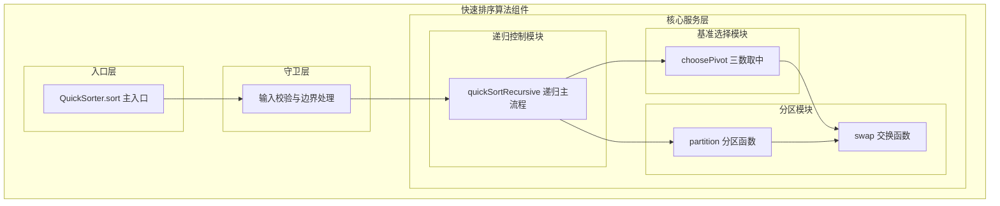
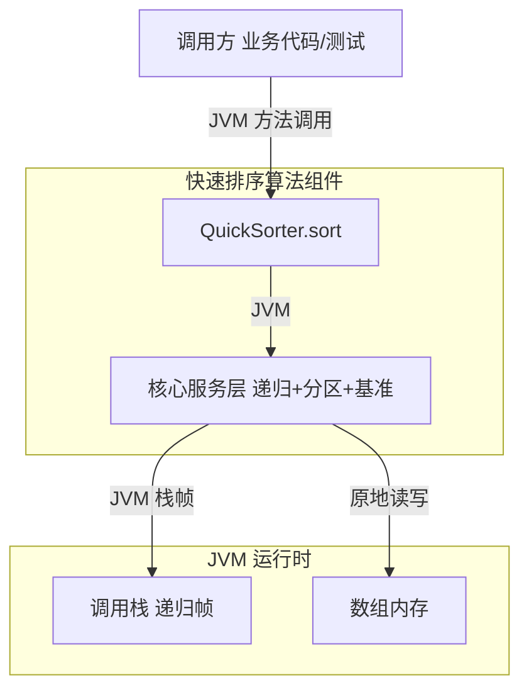
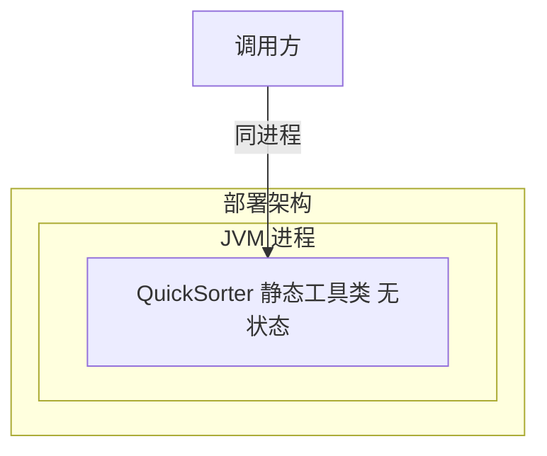
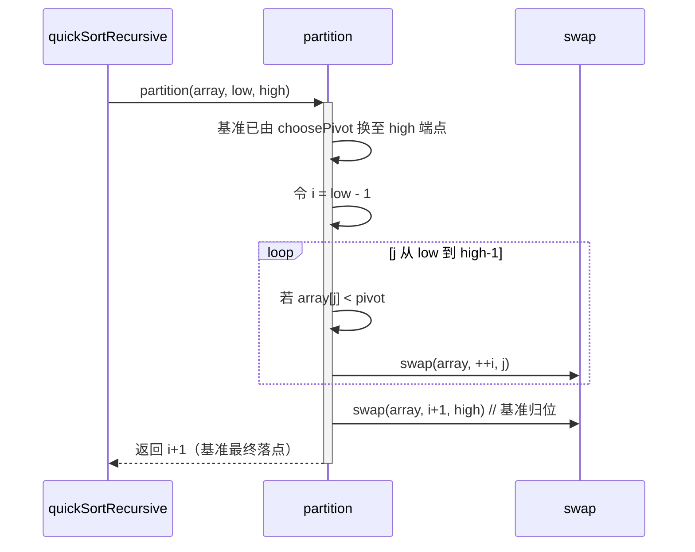
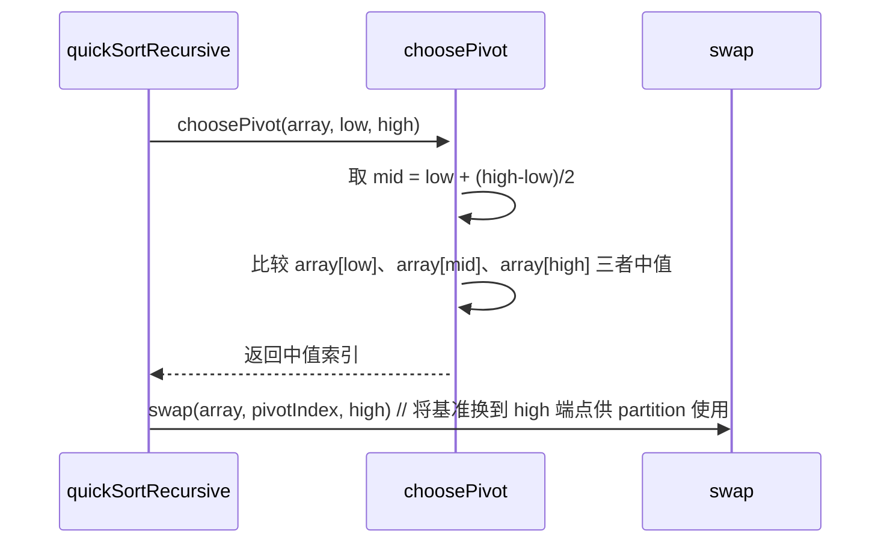

> **文档元信息**
>
> | 项目 | 内容 |
> |------|------|
> | 文档版本 | v1.0 |
> | 作者 | AI |
> | 创建日期 | 2026-07-28 |
> | 需求来源 | 用户需求描述：实现一个快速排序算法 |
> | 评审状态 | 待评审 |

# 快速排序算法 系分设计

## 1. 需求与范围

### 背景与目标
- **背景**：系统需要对可比较元素集合进行排序，以支撑后续统计、去重、区间查询等场景。排序是基础算法能力，需提供一个通用、高效、可复用的快速排序实现。
- **目标**：实现一个基于分治思想的原地快速排序算法，平均时间复杂度 O(n log n)，空间复杂度 O(log n)（递归栈），对外提供泛型排序入口。

### 核心功能
- 快速排序主入口：接收待排序数组并完成原地升序排序。
- 分区（partition）：依据基准元素将数组划分为「小于基准」与「大于等于基准」两部分。
- 基准选择策略：采用三数取中（median-of-three）以缓解最坏情况退化。
- 输入校验：对 null 数组、空数组、单元素数组进行边界处理。

### 约束与非功能要求
- 语言：Java。
- 平均时间复杂度：O(n log n)；最坏 O(n²)，需通过基准选择策略规避典型退化场景（已排序、逆序、全等元素）。
- 空间复杂度：O(log n) 递归栈深度。
- 排序稳定性：快速排序为**不稳定排序**，需求未要求稳定性，故可接受。
- 原地排序：仅在数组内部交换，不额外分配与输入同规模的辅助数组。

### 排除范围
- 不实现多线程/并行快速排序。
- 不实现外部排序（数据量超出内存）。
- 不提供自定义 Comparator 的多策略重载（本期仅支持自然序 Comparable；后续可扩展）。

### 需求功能清单与优先级

| 编号 | 功能点 | 优先级 | PRD 原始描述/章节 | 备注 |
|------|--------|--------|-------------------|------|
| F01 | 快速排序主入口（sort） | P0 | 实现一个快速排序算法 | 对外暴露的唯一主功能 |
| F02 | 分区函数（partition） | P0 | 实现一个快速排序算法 | 核心分治逻辑 |
| F03 | 基准选择策略（choosePivot） | P0 | 实现一个快速排序算法 | 规避最坏退化的关键 |
| F04 | 输入校验与边界处理 | P1 | 实现一个快速排序算法 | null/空/单元素 |

### 假设与待确认项

| 编号 | 假设/待确认内容 | 当前假设 | 确认状态 |
|------|-----------------|----------|----------|
| A01 | 待排序元素类型实现 `java.lang.Comparable` | 当前假设支持自然序排序 | 已确认（需求未指定 Comparator，取自然序为默认） |
| A02 | 数组元素可为 null 的处理 | 当前假设数组引用不为 null，但元素允许为 null 且 null 视为最小 | 待确认（本期暂按元素不允许含 null 实现，见 R02） |
| A03 | 是否需要保留原数组副本 | 当前假设原地排序，不保留副本 | 已确认 |

## 2. 架构与模块

### 功能架构

- **入口层说明**：`QuickSorter.sort` 是对外唯一入口，接收泛型数组并完成原地排序。
- **核心服务层说明**：
  - 递归控制模块负责分治递归调度与递归终止判定。
  - 基准选择模块通过三数取中确定 partition 的基准，规避典型退化。
  - 分区模块依据基准完成数组划分，交换函数提供底层元素互换。
- **守卫层说明**：在主入口对 null、空、单元素数组短路返回，避免无效递归。

**模块清单**

| 模块 | 职责 | 依赖 |
|------|------|------|
| 入口层（QuickSorter） | 对外暴露排序入口，参数校验与递归启动 | 核心服务层 |
| 递归控制模块 | 分治递归调度、递归终止 | 分区模块、基准选择模块 |
| 基准选择模块 | 三数取中确定基准索引 | 交换模块（用于将基准换到端点） |
| 分区模块 | 依据基准划分数组为两部分 | 交换模块 |
| 守卫层 | 边界输入短路 | 无 |

### 应用集成架构

<!-- 快速排序为纯内存算法组件，无外部中间件与外部服务依赖 -->

**集成关系说明：**

| 调用方 | 被调用方 | 协议 | 接口类型 | 说明 |
|--------|----------|------|----------|------|
| 业务代码/测试 | QuickSorter.sort | JVM 方法调用 | 静态方法 | 传入 `T[]` 完成原地排序 |
| QuickSorter | JVM 运行时（栈/堆） | JVM | 内存读写 | 递归栈 + 数组原地交换 |

### 部署架构

- **说明**：`QuickSorter` 为无状态静态工具类，随宿主 JVM 进程部署，无独立部署单元、无负载均衡、无数据层。

## 3. 数据模型与存储

### 实体清单

> 本组件为纯算法/工具组件，**无持久化实体、无数据库存储**。排序操作直接在调用方传入的内存数组上原地完成，不产生任何持久化数据。

### 实体关系图

> 无实体关系。组件内存模型仅涉及对传入 `T[]` 的下标读写与交换，无关系建模。

**模型说明：**
- 排序过程不创建与输入同规模的辅助数组，仅在常数级临时变量（pivot 缓存、索引 i/j、临时交换变量）上消耗内存。
- 递归栈深度取决于分治均衡程度，平均 O(log n)，最坏 O(n)（通过基准选择策略规避）。

## 4. 接口设计

### 4.1 oneapi（Web 控制台接口）

> 无。本组件为算法工具类，不提供 Web 控制台接口。

### 4.2 OpenAPI（对外接口）

> 无。本组件不对外暴露 OpenAPI。

### 4.3 内部接口（Service 层 / 工具类方法）

| 编号 | 接口名称 | 类 | 方法签名 |
|------|----------|------|----------|
| S01 | 快速排序主入口 | `QuickSorter` | `public static <T extends Comparable<? super T>> void sort(T[] array)` |
| S02 | 递归主流程（内部） | `QuickSorter` | `private static <T> void quickSortRecursive(T[] array, int low, int high)` |
| S03 | 分区函数（内部） | `QuickSorter` | `private static <T> int partition(T[] array, int low, int high)` |
| S04 | 基准选择（内部） | `QuickSorter` | `private static <T> int choosePivot(T[] array, int low, int high)` |
| S05 | 元素交换（内部） | `QuickSorter` | `private static <T> void swap(T[] array, int i, int j)` |

### 4.4 集成接口（Integration 层）

> 无。本组件不集成任何外部服务或 Client。

## 5. 功能模块设计

### 5.1 快速排序模块

#### 5.1.1 表结构设计

> 本模块无表结构。快速排序为纯内存算法，不涉及数据库表设计。

##### 5.1.1.x 枚举与常量定义

| 枚举名称 | 取值 | 含义 | 关联字段 |
|----------|------|------|----------|
| `INSERTION_SORT_THRESHOLD` | 16 | 子数组长度 ≤ 该阈值时切换为插入排序以减少递归开销 | `quickSortRecursive` 内部判定 |

#### 5.1.2 接口详细设计

##### S01 快速排序主入口

- **URI**: 无（JVM 静态方法）
- **描述**: 接收泛型可比较数组，完成原地升序排序；对 null、空、单元素数组短路返回。
- **入参**:

| 参数名称 | 类型 | 是否必填 | 描述 |
|----------|------|----------|------|
| array | `T[]`（T extends Comparable<? super T>） | 是 | 待排序数组，原地排序，调用后原数组即为有序 |

- **出参**: 无（void，副作用为修改入参数组）

- **错误码**:

| 错误码 | 说明 |
|--------|------|
| `NullPointerException` | 入参 array 为 null 时抛出（R01） |

- **业务规则**: 见 5.1.3 业务规则表 R01~R04。

- **请求示例**:
```java
Integer[] array = {5, 2, 9, 1, 5, 6};
QuickSorter.sort(array);
```

- **响应示例**:
```java
// array 原地变为：[1, 2, 5, 5, 6, 9]
```

#### 5.1.3 子功能详细设计

##### 5.1.3.1 快速排序主流程（F01）

- 处理时序图
```mermaid
sequenceDiagram
    participant Caller as 调用方
    participant Entry as QuickSorter.sort
    participant Guard as 输入校验
    participant Rec as quickSortRecursive
    participant Part as partition
    participant Pivot as choosePivot
    participant Swap as swap

    Caller->>+Entry: sort(array)
    Entry->>+Guard: 校验 null/空/单元素
    alt 边界输入
        Guard-->>Entry: 短路返回
        Entry-->>-Caller: return
    else 正常输入
        Guard->>Rec: quickSortRecursive(array, 0, len-1)
        Rec->>Rec: 判定子数组长度 ≤ 阈值? 切插入排序
        Rec->>+Pivot: choosePivot(array, low, high)
        Pivot-->>Rec: 返回基准索引并换至端点
        Rec->>+Part: partition(array, low, high)
        Part->>Swap: 多次交换
        Part-->>-Rec: 返回基准最终落点 pivotIndex
        Rec->>Rec: quickSortRecursive(low, pivotIndex-1)
        Rec->>Rec: quickSortRecursive(pivotIndex+1, high)
        Rec-->>Entry: 递归完成
        Entry-->>-Caller: return（数组已有序）
    end
```

**业务规则：**

| 规则编号 | 规则描述 | 校验时机 | 不满足时的处理 |
|----------|----------|----------|--------------|
| R01 | 入参 array 不为 null | 入口始终 | 抛出 `NullPointerException` |
| R02 | 数组元素不允许为 null | 比较时 | 抛出 `NullPointerException`（Comparable.compareTo 遇 null 抛出） |
| R03 | 子数组长度 ≤ 1 时终止递归 | 递归入口 | 直接返回，不再分区 |
| R04 | 子数组长度 ≤ `INSERTION_SORT_THRESHOLD` 时切换插入排序 | 递归入口 | 调用插入排序完成小段排序后返回 |

**异常场景：**

| 异常场景 | 处理方式 |
|----------|----------|
| array 为 null | 抛出 NullPointerException |
| array 元素含 null | 在 compareTo 比较阶段抛出 NullPointerException（本期不特殊兜底） |
| 数组长度为 0 或 1 | 短路返回，不进入递归 |
| 递归深度过大（极端退化） | 三数取中基准 + 小段切插入排序双重规避；理论上仍存在 O(n) 栈深风险，依赖 JVM 栈容量 |

> 本模块不涉及事务操作，无回滚策略。

**并发控制（如涉及数据写入）：**
- 并发场景：`QuickSorter` 为无状态静态工具类，排序操作作用于调用方传入数组的栈/堆引用，单次调用为单线程内同步执行。
- 控制策略：无并发风险，原因：算法本身无共享可变状态；并发安全由调用方自行保证（若多线程同时排序同一数组，需调用方加锁，不在算法组件范围内）。

##### 5.1.3.2 分区子功能（F02）

- 处理时序图


**分区不变量（loop invariant）：**
- 区间 `[low, i]` 内元素均 `< pivot`。
- 区间 `(i, j)` 内元素均 `≥ pivot`。
- 区间 `[j, high-1]` 为未处理区间。
- 循环结束后将基准从 `high` 归位至 `i+1`，使基准左侧均小于、右侧均大于等于基准。

##### 5.1.3.3 基准选择子功能（F03）

- 处理时序图


**策略说明：**
- 采用**三数取中（median-of-three）**：在 `low`、`mid`、`high` 三个元素中选取中位数作为基准。
- 目的：针对已排序、逆序输入，将基准置于端点，避免 partition 退化为单侧长度 0、另一侧长度 n-1 的最坏情况，使递归树更均衡。
- 选定基准后与 `high` 端点元素交换，统一由 partition 的 Lomuto 风格分区流程处理。

## 6. 非功能性需求设计

### 6.1 高可用性
- 本组件为纯算法组件，无上下游外部依赖（无 DB、无 RPC、无 MQ），不存在外部故障导致的可用性下降。
- 组件随宿主 JVM 进程运行，可用性等价于宿主进程可用性。
- 降级：若调用方对耗时敏感且出现异常退化，可降级为 JDK 内置 `Arrays.sort` 兜底（见 7.3）。

### 6.2 可扩展性
- 泛型设计：`T extends Comparable<? super T>`，支持任意实现 Comparable 的类型。
- 后续可扩展点：增加 `sort(T[] array, Comparator<? super T> cmp)` 重载，支持自定义比较器；增加对小段插入排序阈值的可配置化。
- 无状态静态方法天然支持并发调用，水平扩展能力等价于宿主进程。

### 6.3 稳定性/可靠性
- **边界场景验证清单**：
  - 空数组、单元素数组：短路返回，正确。
  - 已排序数组：三数取中使基准为真实中位数，递归树均衡，复杂度 O(n log n)。
  - 逆序数组：同上，规避退化。
  - 全等元素数组：partition 每轮一侧为空、一侧为 n-1 的退化风险存在；通过小段切换插入排序（≤16）缓解总体递归深度。
  - 含重复元素数组：稳定输出有序（但快排本身不稳定，等值元素相对顺序不保证）。
- **可靠性结论**：在常规与典型退化场景下结果稳定可靠；极端构造输入下理论上仍存在 O(n²) 时间与 O(n) 栈深风险，属快速排序算法固有特性，需调用方知悉。

### 6.4 安全性设计

#### 6.4.1 账户系统方案
- 不涉及。本组件无账户、无登录态、无用户体系。

#### 6.4.2 授权&访问控制
##### 6.4.2.1 是否实现水平权限检查
- 不涉及。无数据库查询、无资源归属判定。

##### 6.4.2.2 是否实现垂直权限检查
- 不涉及。无角色权限体系。

##### 6.4.2.3 是否检查登录态
- 不涉及。组件不对外暴露 HTTP 接口，无登录态校验需求。

#### 6.4.3 数据防护方案
##### 6.4.3.1 是否对敏感数据加密存储
- 不涉及。无持久化、无敏感数据存储。

##### 6.4.3.2 是否对敏感数据展示进行脱敏
- 不涉及。组件仅做内存数组排序，无展示、无日志输出敏感数据。若调用方数组含敏感字段，脱敏责任在调用方展示层。

### 6.5 监控/统计/日志/告警
- 关键监控点：`QuickSorter.sort` 单次调用耗时、递归最大深度、分区比较次数。
- 告警点：单次排序耗时显著偏离 O(n log n) 预期（如对大数组耗时突增）时，提示可能触发最坏退化。
- 日志：DEBUG 级别记录入参数组长度与耗时，不记录数组具体内容以避免敏感数据泄漏与日志膨胀。

## 7. 变更三板斧

### 7.1 可监控
- 在 `QuickSorter.sort` 入口/出口埋点耗时（建议通过宿主 APM 或简单 `System.nanoTime` 计时）。
- 记录递归最大深度指标，用于识别退化场景。
- 记录分区比较次数指标，用于复杂度回归对比。

### 7.2 可灰度
- 作为算法库，灰度策略为「新旧排序实现并存 + 开关切换」：
  - 保留旧排序实现（如 JDK `Arrays.sort` 或既有实现）作为兜底路径。
  - 通过配置开关（如系统属性 `-Dquicksort.enabled=true`）决定是否启用新 `QuickSorter.sort`。
  - 灰度范围可按调用点逐步放量，先在低风险统计场景验证正确性与性能，再扩展至核心链路。
- 若不可灰度（如改造为替换式内部调用），原因需在上线评审中说明并补充充分测试覆盖。

### 7.3 可应急
- 保留应急开关：当新 `QuickSorter` 出现性能退化或正确性疑虑时，通过开关（7.2）一键回退至旧实现/JDK `Arrays.sort`，无需代码回滚。
- 应急路径不引入额外依赖（JDK `Arrays.sort` 为内置能力），回滚依赖关系简单，不存在回滚后连锁影响。
- 关键功能不涉及数据持久化，无需考虑数据回滚与状态一致性。
