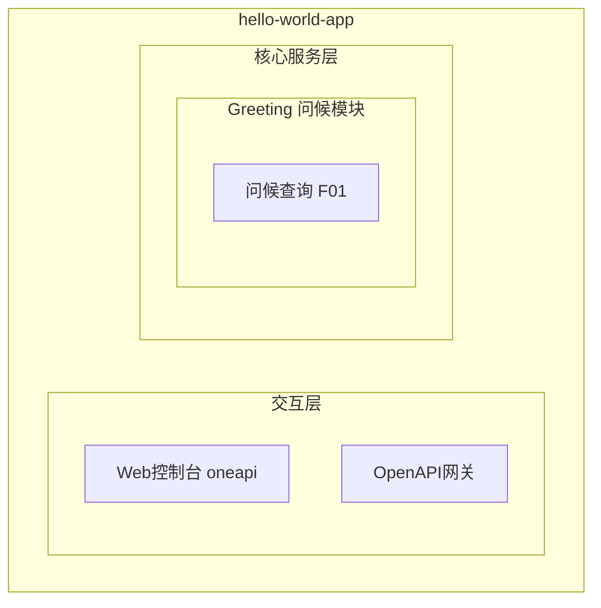
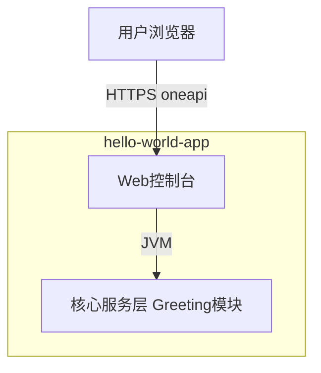
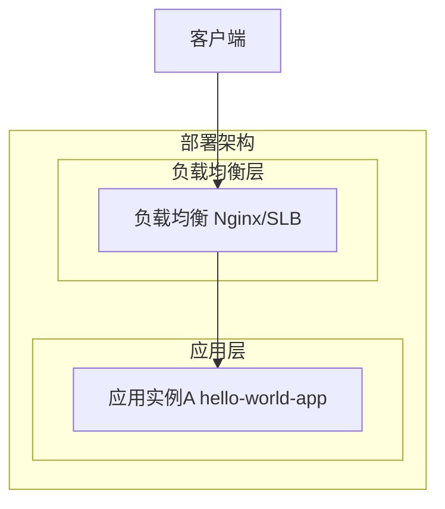
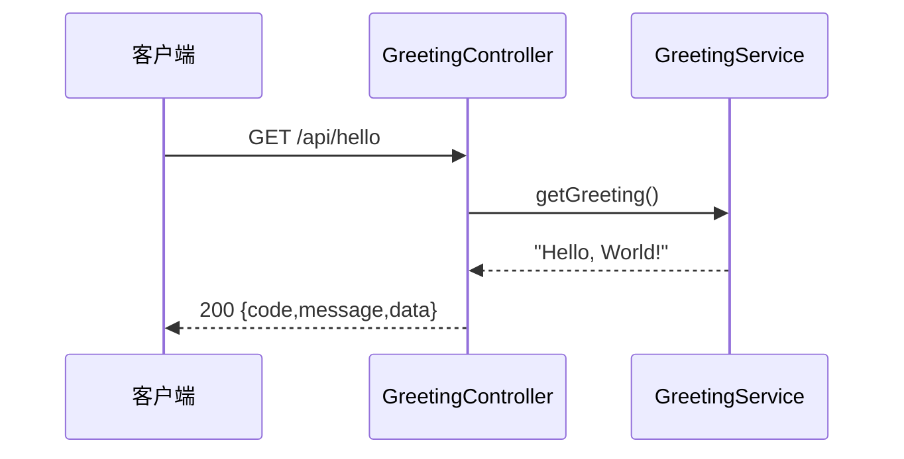

> **文档元信息**
>
> | 项目 | 内容 |
> |------|------|
> | 文档版本 | v1.0 |
> | 作者 | 系分生成引擎 |
> | 创建日期 | 2026-07-29 |
> | 需求来源 | 需求描述：hello world |
> | 评审状态 | 待评审 |

# Hello World 问候服务 系分设计

## 1. 需求与范围
- 背景与目标：作为最小可运行示例，提供一个对外返回固定问候语 "Hello, World!" 的 HTTP 接口，用于验证服务可启动、可访问、可监控的最基础链路，并为后续业务模块提供工程骨架。
- 核心功能：通过 HTTP GET 请求返回问候文本 "Hello, World!"。
- 约束与非功能要求：响应延迟低（本地内存构造，无外部依赖）；无状态；接口需可被监控埋点；代码需遵循 dtazziboot Java 编码规范。
- 排除范围：不涉及用户体系、权限校验、数据库持久化、缓存、外部系统集成、多环境灰度等复杂能力。

### 需求功能清单与优先级

| 编号 | 功能点 | 优先级 | PRD 原始描述/章节 | 备注 |
|------|--------|--------|-------------------|------|
| F01 | 提供 GET 问候接口返回 "Hello, World!" | P0 | 需求描述：hello world | 唯一核心功能 |

### 假设与待确认项

| 编号 | 假设/待确认内容 | 当前假设 | 确认状态 |
|------|-----------------|----------|----------|
| A01 | 技术栈采用 Java + Spring Boot | 是，与团队 JVM/oneapi 工程惯例一致 | 待确认 |
| A02 | 无需持久化，问候语为硬编码常量 | 是，hello world 为最小示例 | 待确认 |
| A03 | 无需鉴权，接口对外公开可访问 | 是，问候内容为公开文本 | 待确认 |

## 2. 架构与模块
### 功能架构

- 交互层说明：用户通过 HTTP（oneapi REST）访问问候接口；本需求暂不暴露 OpenAPI 对外网关接口，仅提供 Web 控制台风格的 oneapi 接口。
- 核心服务层说明：Greeting 问候模块负责构造并返回 "Hello, World!" 文本，无外部依赖。
- 扩展/集成层说明：本需求不涉及扩展/集成层。

**模块清单**

| 模块 | 职责 | 依赖 |
|------|------|------|
| Greeting 问候模块 | 构造并返回问候语 "Hello, World!" | 无 |

### 应用集成架构

<!-- hello world 为无状态服务，无数据库/缓存/外部服务依赖 -->

**集成关系说明：**

| 调用方 | 被调用方 | 协议 | 接口类型 | 说明 |
|--------|----------|------|----------|------|
| 用户浏览器 | 应用 Web控制台 | HTTPS | oneapi REST | 调用 GET /api/hello 获取问候语 |

### 部署架构

<!-- hello world 为无状态轻量服务，最小可单实例部署 -->

**部署说明：**
- **负载均衡层**：Nginx/SLB 转发 HTTPS 流量至应用实例。
- **应用层**：单实例即可满足；无状态，水平扩缩容无数据一致性约束。
- **数据层**：不涉及，服务无持久化需求。

## 3. 数据模型设计
本需求为无状态问候服务，不涉及数据库持久化，无实体表、索引与状态字段设计。

### 3.1 持久化模型
- 无数据库表设计。问候语 "Hello, World!" 作为应用常量定义于代码中，不落库。

### 3.2 数据字典
- 无数据字典。无枚举值、状态码需要持久化管理。

## 4. 接口设计
### 4.1 OpenAPI 对外接口清单
本需求仅暴露内部 oneapi 接口，暂不对外暴露 OpenAPI 网关接口。

| 编号 | 接口名称 | 请求方式 | 接口路径 | 所属模块 | 是否幂等 |
|------|----------|----------|----------|----------|----------|
| O01 | 查询问候语 | GET | /api/hello | Greeting 问候模块 | 是 |

### 4.2 oneapi 内部接口详细设计
#### 4.2.1 查询问候语（GET /api/hello）

**请求参数：**

| 参数名称 | 参数类型 | 是否必填 | 参数说明 | 限制/枚举 |
|----------|----------|----------|----------|------------|
| 无 | - | - | 本接口无请求参数 | - |

**请求示例：**
```http
GET /api/hello HTTP/1.1
Host: hello-world-app.example.com
```

**响应参数：**

| 字段名称 | 字段类型 | 是否必填 | 字段说明 |
|----------|----------|----------|----------|
| code | Integer | 是 | 状态码，成功返回 200 |
| message | String | 是 | 描述信息，成功返回 "success" |
| data | String | 是 | 问候语内容，固定为 "Hello, World!" |

**成功响应示例：**
```json
{
  "code": 200,
  "message": "success",
  "data": "Hello, World!"
}
```

**失败响应示例：**
```json
{
  "code": 500,
  "message": "Internal Server Error",
  "data": null
}
```

**业务异常码：**

| 异常码 | 含义 | 处理建议 |
|--------|------|----------|
| 200 | 成功 | - |
| 500 | 服务内部错误 | 排查应用启动与 JVM 运行状态 |

### 4.3 内部接口（Service 层）

| 编号 | 接口名称 | 类 | 方法 | 入参 | 出参 | 说明 |
|------|----------|----|------|------|------|------|
| S01 | 获取问候语 | GreetingService | getGreeting() | 无 | String | 返回 "Hello, World!" |

**内部接口说明：**
- `GreetingService.getGreeting()`：无入参，直接返回常量字符串 "Hello, World!"，供 Controller 层调用。该方法为纯函数式构造，无副作用，线程安全。

## 5. 模块详细设计
### 5.1 Greeting 问候模块

**职责：** 构造并返回固定问候语 "Hello, World!"，承载 F01 功能。

**核心逻辑：**
- 接收 GET /api/hello 请求。
- 调用 `GreetingService.getGreeting()` 获取问候语常量。
- 包装为统一响应体（code/message/data）返回。

**类设计：**

| 类 | 类型 | 职责 |
|----|------|------|
| GreetingController | Controller | 接收 HTTP 请求，调用 Service，返回响应 |
| GreetingService | Service | 提供问候语获取逻辑，返回常量 |

**时序图：**


**并发控制策略：**
- 无并发风险，原因：问候语为不可变常量，Service 方法无共享可变状态，天然线程安全，无需锁或幂等键设计。

**状态机设计：**
- 本模块无状态字段，无状态机设计。

## 6. 非功能性需求设计
### 6.1 高可用性
- 问候服务无外部依赖（无 DB/缓存/MQ），不存在上下游故障传导风险。
- 单实例故障由负载均衡层健康检查摘除节点；无状态服务重启即恢复，无需降级策略。

### 6.2 可扩展性
- 服务无状态，可水平扩缩容，扩容无数据一致性问题。
- 问候语如需可配置化，后续可扩展为读取配置中心，当前以常量实现保持最小化。

### 6.3 稳定性/可靠性
- 边界场景：高并发请求下，常量构造为 O(1) 内存操作，不会成为瓶颈；响应体小，网络开销低。
- JVM 内存压力下，无大对象分配，GC 影响极小，运行结果稳定可靠。

### 6.4 安全性设计
#### 6.4.1 账户系统方案
- 不涉及账户体系。问候内容为公开文本，无需登录鉴权。

#### 6.4.2 授权&访问控制
##### 6.4.2.1 是否实现水平权限检查
- 不涉及数据库查询、公共数据查询，无水平权限检查需求。

##### 6.4.2.2 是否实现垂直权限检查
- 不涉及数据库查询或公共数据查询，无垂直权限检查需求。

##### 6.4.2.3 是否检查登录态
- 不检查登录态，/api/hello 为公开接口，配置白名单放行。

#### 6.4.3 数据防护方案
##### 6.4.3.1 是否对敏感数据加密存储
- 不涉及敏感数据，问候语为公开常量，无需加密存储。

##### 6.4.3.2 是否对敏感数据展示进行脱敏
- 不涉及敏感数据，无需脱敏展示。

### 6.5 监控/统计/日志/告警
- 监控点：接口 QPS、响应延迟 RT、HTTP 状态码分布（2xx/5xx）。
- 日志：记录请求入口与异常堆栈；正常请求无敏感信息打印。
- 告警：5xx 错误率超阈值告警。

## 7. 变更三板斧
### 7.1 可监控
- 对 GET /api/hello 接口埋点：请求量、RT、错误率。
- JVM 基础监控：CPU、内存、GC。

### 7.2 可灰度
- hello world 为最小无依赖功能，无灰度诉求；如需灰度，可通过网关按流量比例路由新版本即可。

### 7.3 可应急
- 关键功能保留开关：可配置 `greeting.enabled` 开关，关闭时返回维护提示，提供快速应急能力。
- 应急以开关切换为主，避免回滚；无状态服务回滚无依赖关系风险。
