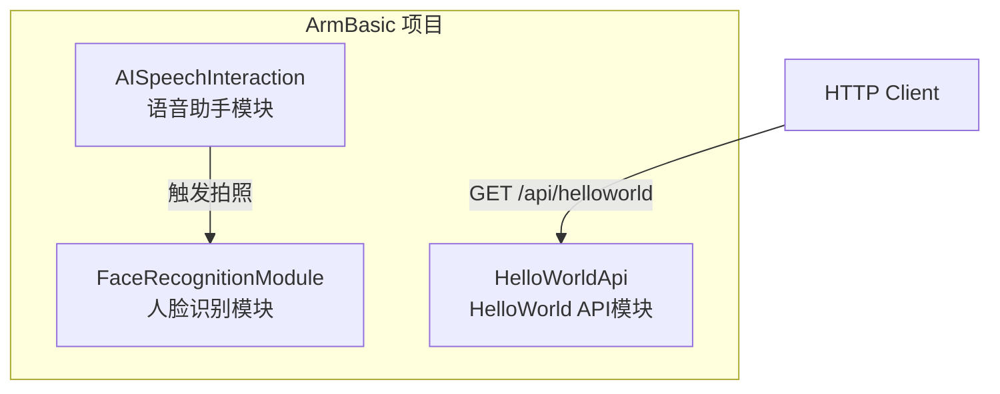
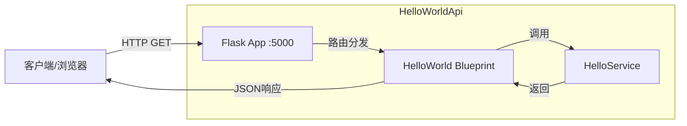
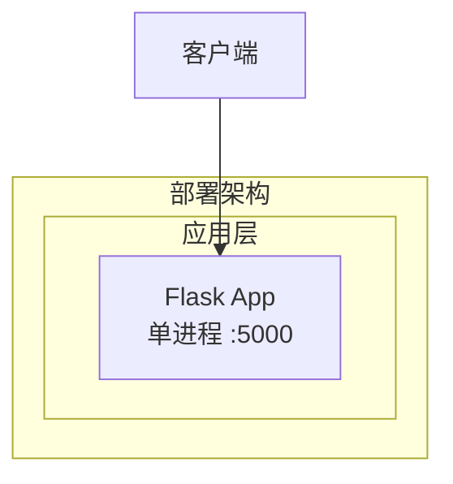
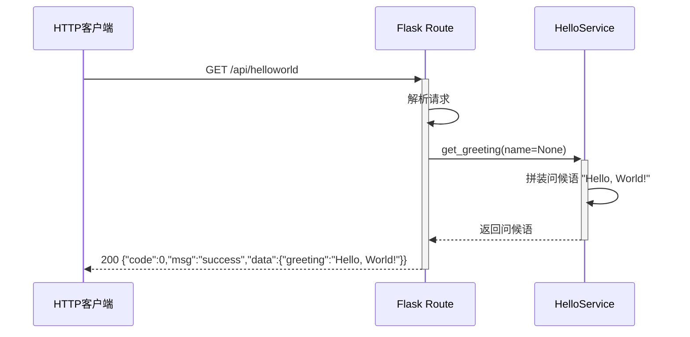
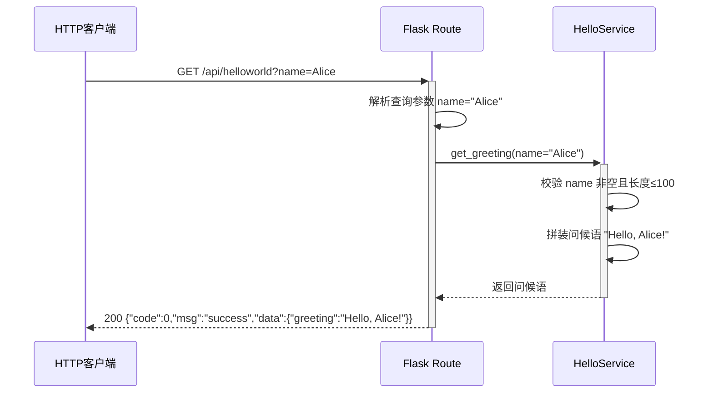

> **文档元信息**
>
> | 项目 | 内容 |
> |------|------|
> | 文档版本 | v1.0 |
> | 作者 | DTCoder |
> | 创建日期 | 2026-06-18 |
> | 需求来源 | 任务描述：实现一个 helloworld 接口 |
> | 评审状态 | 待评审 |

# HelloWorld 接口 系分设计

## 1. 需求与范围

### 背景与目标

**背景**：当前 ArmBasic 项目已具备语音交互（AISpeechInteraction）和人脸识别（FaceRecognitionModule）两大模块，缺乏对外 HTTP API 的暴露能力。为后续模块间解耦、外部系统对接、以及服务化演进，需新增一个基础的 HTTP 接口。

**目标**：实现一个 helloworld HTTP 接口，验证项目具备对外提供 RESTful API 的能力，为后续功能接口化奠定基础。

### 核心功能

| 编号 | 功能点 | 描述 | 优先级 |
|------|-------|------|--------|
| F01 | helloworld GET 接口 | 客户端通过 HTTP GET 请求 `/api/helloworld`，返回 "Hello, World!" 响应 | P0 |
| F02 | 参数化问候 | 可选传入 name 参数，返回个性化问候如 "Hello, {name}!" | P1 |

### 约束与非功能要求

- **技术栈约束**：基于项目现有 Python 生态，使用轻量级 HTTP 框架（Flask）
- **端口**：默认使用 5000 端口（Flask 默认），可配置
- **响应格式**：JSON，结构 `{"code": 0, "msg": "success", "data": {...}}`
- **性能**：单实例支撑 100 QPS（轻量接口，无瓶颈）
- **可用性**：面向开发验证，不要求高可用多副本

### 排除范围

- 不涉及用户认证/鉴权
- 不涉及数据库操作
- 不涉及日志持久化
- 不涉及 HTTPS/TLS
- 不涉及限流/熔断等高级特性

### 需求功能清单与优先级

| 编号 | 功能点 | 优先级 | PRD 原始描述/章节 | 备注 |
|------|--------|--------|-------------------|------|
| F01 | helloworld GET 接口 | P0 | 需求描述「实现一个helloworld接口」 | 核心功能 |
| F02 | 参数化问候 | P1 | 合理扩展 | 假设：helloworld 接口通常支持 name 参数 |

### 假设与待确认项

| 编号 | 假设/待确认内容 | 当前假设 | 确认状态 |
|------|-----------------|----------|----------|
| A01 | 框架选型 | Flask | 待确认 |
| A02 | 模块归属 | 新建独立模块 HelloWorldApi | 待确认 |
| A03 | 端口 | 5000（Flask 默认） | 待确认 |
| A04 | 响应格式 | `{code, msg, data}` | 待确认 |
| A05 | 接口路径 | `/api/helloworld` | 待确认 |

---

## 2. 架构与模块

### 功能架构



- **交互层说明**：HelloWorldApi 通过 Flask Blueprint 注册路由，对外暴露 `/api/helloworld` 端点
- **核心服务层说明**：HelloService 提供纯业务逻辑（问候语拼装），无状态
- **扩展/集成层说明**：无外部集成

**模块清单**

| 模块 | 职责 | 依赖 |
|------|------|------|
| HelloWorldApi | 提供 helloworld HTTP 接口，处理参数化问候 | 无（独立模块） |
| AISpeechInteraction | 语音助手，麦克风→ASR→LLM→TTS | FaceRecognitionModule |
| FaceRecognitionModule | 摄像头人脸识别 | 无 |

**分层设计**（HelloWorldApi 内部）：

| 层 | 职责 | 说明 |
|----|------|------|
| 路由层 (routes) | HTTP 请求路由注册、参数解析 | Flask Blueprint |
| 服务层 (service) | 业务逻辑：问候语拼装 | 纯函数，无状态 |
| 入口层 (app) | Flask 应用初始化、配置加载 | 启动入口 |

### 应用集成架构



**集成关系说明：**

| 调用方 | 被调用方 | 协议 | 接口类型 | 说明 |
|--------|----------|------|----------|------|
| 客户端/浏览器 | HelloWorldApi Flask App | HTTP | oneapi REST | 直接调用 helloworld 接口 |

### 部署架构



**部署说明：**
- **负载均衡层**：不涉及，单进程部署
- **应用层**：单实例 Flask 应用，直接监听 5000 端口
- **数据层**：不涉及，无数据库

**架构选型方案对比：**

| 方案 | Flask | FastAPI | aiohttp |
|------|-------|---------|---------|
| 学习成本 | 低 | 中 | 中 |
| 异步支持 | 需插件 | 原生 | 原生 |
| 生态成熟度 | 高 | 中高 | 中 |
| 适合场景 | 简单API/原型 | 高性能异步API | 纯异步场景 |

**推荐方案**：Flask —— 理由：项目为 Python 生态，需求简单（helloworld 无异步/高性能要求），Flask 最轻量、社区最成熟，符合"最小改动"原则。

---

## 3. 数据模型与存储

### 实体清单

本项不适用，原因：helloworld 接口为纯计算型接口，不涉及数据持久化，无数据库实体。

### 实体关系图

本项不适用，原因：无实体。

### 缓存/MQ

本项不适用，原因：helloworld 接口逻辑极简（字符串拼接），无缓存/MQ 需求。

### 租户隔离

本项不适用，原因：helloworld 接口为全局公共接口，无租户概念。

---

## 4. 接口设计

### 4.1 oneapi（Web 控制台接口）

| 编号 | 接口名称 | 方法 | 路径 | 模块 |
|------|----------|------|------|------|
| API-01 | helloworld 问候 | GET | /api/helloworld | HelloWorldApi |
| API-02 | 参数化问候 | GET | /api/helloworld?name={name} | HelloWorldApi |

### 4.2 OpenAPI（对外接口）

本项不适用，原因：无需第三方系统对接。

### 4.3 内部接口（Service 层）

本项不适用，原因：HelloWorldApi 为独立模块，无内部跨模块调用。

### 4.4 集成接口（Integration 层）

本项不适用，原因：无外部系统集成。

---

## 5. 功能模块设计

### 5.1 HelloWorldApi

#### 5.1.1 表结构设计

本项不适用，原因：helloworld 接口为纯计算型接口，不涉及数据库操作。

##### 5.1.1.x 枚举与常量定义

本模块无枚举/常量定义。

#### 5.1.2 接口详细设计

##### API-01: helloworld 问候

- **URI**: GET /api/helloworld
- **描述**: 返回标准 helloworld 问候语
- **入参**: 无

- **出参**:

| 参数名称 | 类型 | 描述 |
|----------|------|------|
| code | int | 状态码，0 表示成功 |
| msg | string | 提示信息，固定 "success" |
| data | object | 业务数据 |
| data.greeting | string | 问候语，固定 "Hello, World!" |

- **错误码**:

| 错误码 | 说明 |
|--------|------|
| HWA_001 | 服务内部错误（兜底） |

- **业务规则**: 无

- **请求示例**:
```
GET /api/helloworld HTTP/1.1
Host: localhost:5000
```

- **响应示例**:
```json
{
  "code": 0,
  "msg": "success",
  "data": {
    "greeting": "Hello, World!"
  }
}
```

---

##### API-02: 参数化问候

- **URI**: GET /api/helloworld?name={name}
- **描述**: 传入 name 参数返回个性化问候，无参数时回退到默认问候
- **入参**:

| 参数名称 | 类型 | 是否必填 | 描述 |
|----------|------|----------|------|
| name | string | 否 | 问候对象名称，不传则使用默认值 "World" |

- **出参**:

| 参数名称 | 类型 | 描述 |
|----------|------|------|
| code | int | 状态码，0 表示成功 |
| msg | string | 提示信息 |
| data | object | 业务数据 |
| data.greeting | string | 个性化问候语，格式 "Hello, {name}!" |

- **错误码**:

| 错误码 | 说明 |
|--------|------|
| HWA_001 | 服务内部错误（兜底） |

- **业务规则**:

| 规则编号 | 规则描述 | 校验时机 | 不满足时的处理 |
|----------|----------|----------|--------------|
| R01 | name 参数为空字符串时，视为未传参，使用默认值 "World" | 请求处理时 | 静默使用默认值 |
| R02 | name 参数长度不超过 100 字符 | 请求处理时 | 截断至 100 字符 |

- **请求示例**:
```
GET /api/helloworld?name=Alice HTTP/1.1
Host: localhost:5000
```

- **响应示例**:
```json
{
  "code": 0,
  "msg": "success",
  "data": {
    "greeting": "Hello, Alice!"
  }
}
```

#### 5.1.3 子功能详细设计

##### 5.1.3.1 helloworld 问候（F01）

- **处理时序图**



**业务规则：**

| 规则编号 | 规则描述 | 校验时机 | 不满足时的处理 |
|----------|----------|----------|--------------|
| R01 | 无参数请求，默认返回 "Hello, World!" | 请求处理时 | N/A |

**异常场景：**

| 异常场景 | 处理方式 |
|----------|----------|
| 服务进程异常崩溃 | 返回 HTTP 500，由 Flask 框架兜底处理 |
| 请求方法错误（如 POST） | 返回 HTTP 405 Method Not Allowed（Flask 框架自动处理） |

**并发控制：** 无并发风险，原因：纯读接口，无共享状态写入。

**状态机设计：** 本项不适用，原因：无状态字段。

---

##### 5.1.3.2 参数化问候（F02）

- **处理时序图**



**业务规则：**

| 规则编号 | 规则描述 | 校验时机 | 不满足时的处理 |
|----------|----------|----------|--------------|
| R01 | name 为空字符串时使用默认值 "World" | 请求处理时 | 静默使用默认值 |
| R02 | name 长度超过 100 字符时截断 | 请求处理时 | 截断至 100 字符 |

**异常场景：**

| 异常场景 | 处理方式 |
|----------|----------|
| name 参数包含特殊字符 | 不做过滤，直接拼接（假设：无 XSS 风险，纯 JSON 响应） |
| 请求方法错误（如 POST） | 返回 HTTP 405 Method Not Allowed（Flask 框架自动处理） |

**并发控制：** 无并发风险，原因：纯读接口，无共享状态写入。

**状态机设计：** 本项不适用，原因：无状态字段。

---

## 6. 非功能性需求设计

### 6.1 高可用性

本项不适用，原因：helloworld 接口为开发验证阶段的基础接口，单进程部署，不要求高可用。后续如需高可用，可使用 gunicorn 多 worker + Nginx 反向代理实现。

### 6.2 可扩展性

- **水平扩展**：Flask 应用无状态，可直接通过 gunicorn 多 worker 扩展，或通过容器化 + K8s 水平扩容
- **垂直扩展**：单进程资源消耗极低，无需特殊考虑
- **架构扩展性**：模块独立，后续可平滑迁移至 FastAPI / aiohttp 等异步框架

### 6.3 稳定性/可靠性

- 单接口逻辑极简（字符串拼接），无外部依赖，稳定性高
- 无边界条件导致崩溃的风险（参数校验 + 截断保护）
- 假设：单实例足够支撑开发验证阶段

### 6.4 安全性设计

#### 6.4.1 账户系统方案

本项不适用，原因：helloworld 为公共接口，无需登录认证。

#### 6.4.2 授权与访问控制

##### 6.4.2.1 是否实现水平权限检查

本项不适用，原因：公共接口，无数据隔离需求。

##### 6.4.2.2 是否实现垂直权限检查

本项不适用，原因：公共接口，无角色权限需求。

##### 6.4.2.3 是否检查登录态

本项不适用，原因：公共接口，无需登录态。

#### 6.4.3 数据防护方案

##### 6.4.3.1 是否对敏感数据加密存储

本项不适用，原因：无数据存储。

##### 6.4.3.2 是否对敏感数据展示进行脱敏

本项不适用，原因：无敏感数据。

### 6.5 监控/统计/日志/告警

- **日志**：Flask 默认日志输出到 stdout，包含请求方法、路径、状态码、响应时间
- **监控**：开发阶段不做额外埋点；生产阶段可接入 Prometheus + Grafana
- **告警**：开发阶段不设置；生产阶段可基于 HTTP 5xx 错误率设置告警阈值

---

## 7. 变更三板斧

### 7.1 可监控

- **服务埋点**：Flask 框架默认输出请求日志（方法、路径、状态码、响应时间），满足基本监控需求
- **三方服务埋点**：本项不适用，原因：无三方服务调用
- **补充建议**：若后续接入生产监控，可在 Route 层增加埋点，记录调用次数、处理耗时、处理结果

### 7.2 可灰度

本项不适用，原因：helloworld 为纯新增独立模块，无旧逻辑可回退，不需要灰度。后续如需灰度发布，可通过 Nginx 按请求来源 IP 尾号分流或 K8s Ingress canary 按权重引流。

### 7.3 可应急

- **开关控制**：本项不适用，原因：helloworld 为独立接口，无开关切换需求
- **回滚方案**：直接回滚代码即可（新模块无上下游依赖），回滚时注意：
  - 上游：无调用方，回滚无影响
  - 下游：无依赖服务，回滚无影响
  - 自身：回滚即删除 HelloWorldApi 模块，不会产生数据不一致