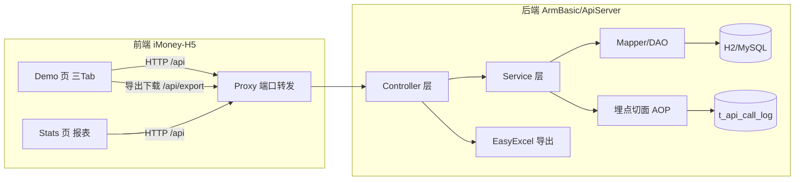
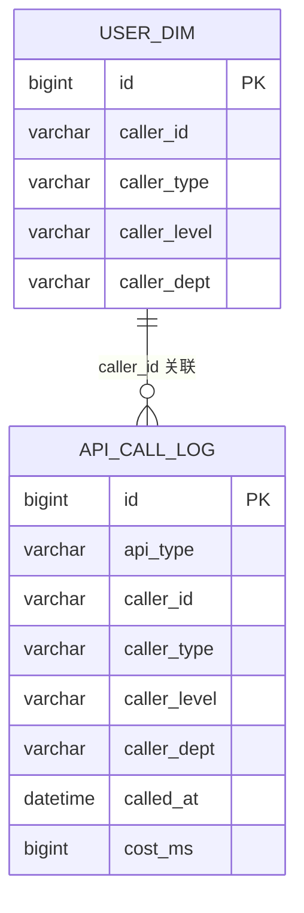
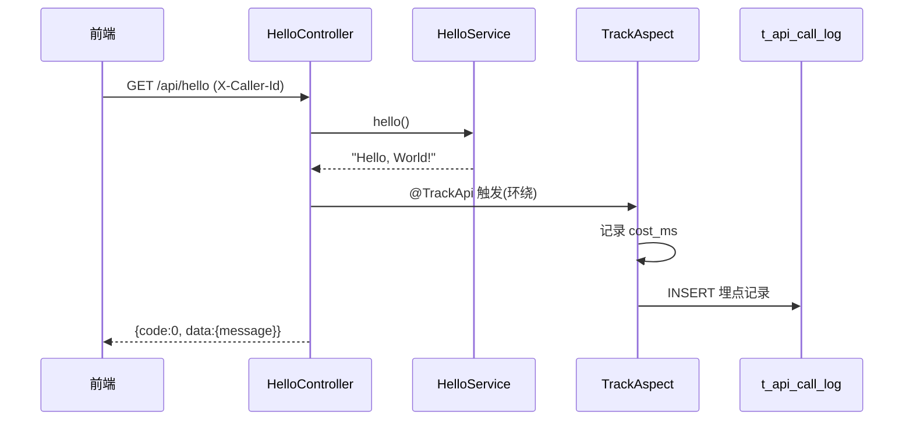
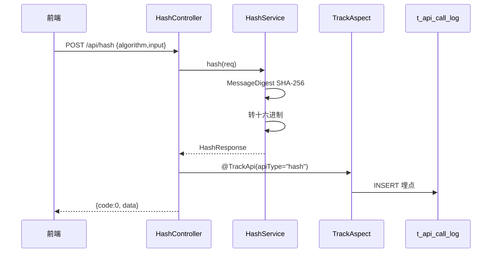
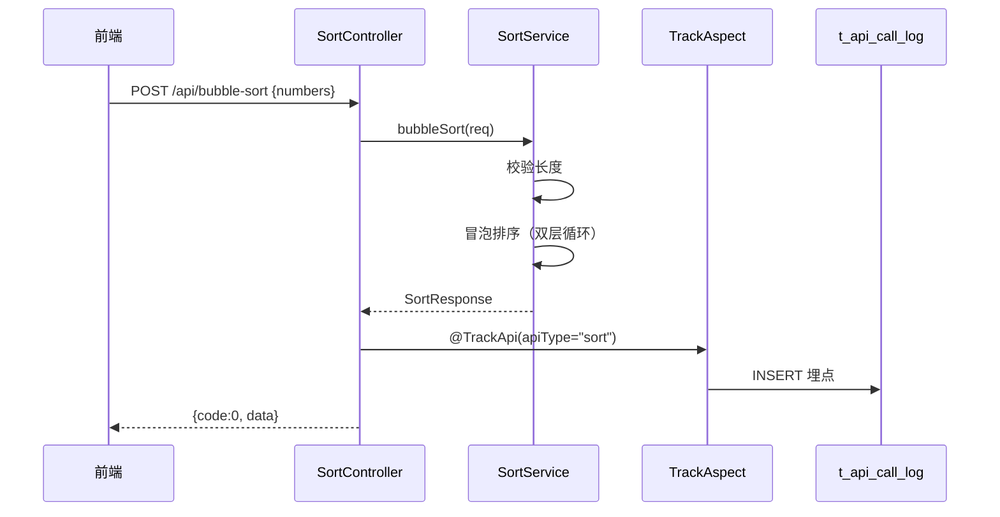
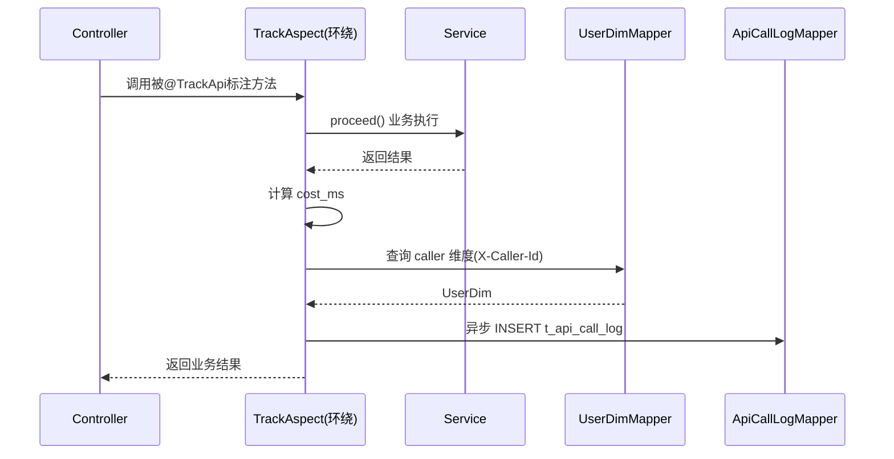
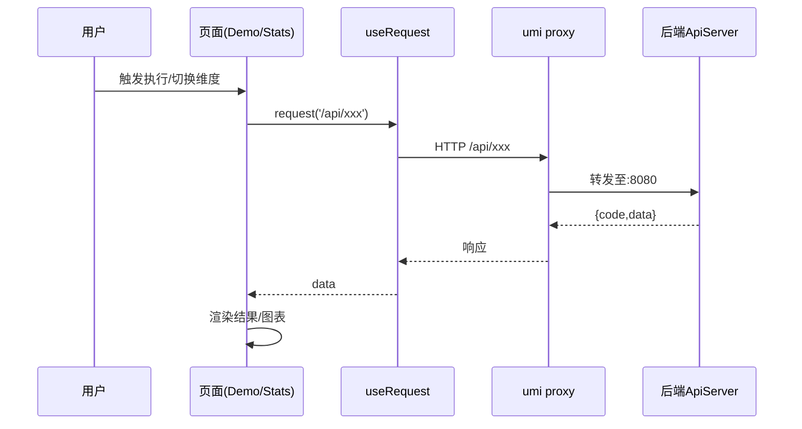

# 系分设计文档（System Analysis & Design）

- 任务节点：系分生成
- 采用技能：/dtazziboot-system-analysis-design
- 设计日期：2026-07-30
- 状态：全量模式（无同模块历史文档），静默接管所有决策
- 上游产物：`ArmBasic/.agents/DEV-966d/requirement-clarification.md`（需求澄清 v2）
- OUTPUT_FILE：`.agents/system.changes/design.md`
- 落盘仓库：ArmBasic

---

## Step 0：项目初始信息

### 0.1 文档路径配置

| 项 | 配置 | 说明 |
|----|------|------|
| 架构文档 | docs/ARCHITECTURE.md（不存在） | ArmBasic 既有为 Python 项目，无 Java 架构文档，本次新建 |
| 模块文档 | docs/modules/**/*.md（不存在） | 无既有模块文档 |
| 系分历史文档 | docs/changes/*.md（不存在） | 判定为全量模式 |
| OUTPUT_FILE | `.agents/system.changes/design.md` | 任务指定 |
| OUTPUT_DIR | `.agents/system.changes` | 自动推导 |
| 设计模式 | 全量模式 | 无同模块历史文档 |

### 0.2 跨仓现状通览（只读探查结论）

| 仓库 | 物理路径 | 性质 | 技术栈 | 与需求相关性 |
|------|---------|------|--------|-------------|
| PH2498.github.io | `…/worktree/PH2498.github.io-master` | 静态博客站 | 纯静态 HTML/CSS/JS | ❌ 不适合 Tab 交互/动态图表 |
| **ArmBasic** ⭐后端 | `…/worktree/ArmBasic-main` | 语音/视觉 AI 项目 | Python（dashscope/SpeechRecognition/PyAudio/edge-tts/opencv/face_recognition） | ✅ 用户指定后端落点；非 Java 工程，需新建 Java 子模块 |
| iMoney-H5 | `…/worktree/iMoney-H5-main` | 移动端 H5 应用 | umi/max(React)+TS+antd-mobile+ant-design-mobile-chart | ✅ 前端落地首选 |
| iMoney | `…/worktree/iMoney-main` | 小程序项目 | project.config.json+小程序体系 | ⚠️ 备选，本轮不涉及 |

### 0.3 已探查证据（前端 iMoney-H5 关键事实）

| 证据点 | 文件 | 结论 |
|--------|------|------|
| 图表库依赖 | `package.json` | `ant-design-mobile-chart@^1.2.2` 已内置，原生支持 Line/Pie/Bar |
| Tab 组件 | `package.json` | `antd-mobile@^5.42.3` 提供 Tabs 组件 |
| 路由配置 | `.umirc.ts` | umi/max，已有 `/home` `/stats` `/ai-assistant` `/mine` 路由，`npmClient: yarn` |
| Stats 空壳页 | `src/pages/Stats/index.tsx` | 当前仅占位（"统计/数据统计页面"），可承载埋点报表 |
| 基础组件 | `src/components/base/` | `MotionWrap.tsx`、`TabBar.tsx` 提供动画包裹与底部 Tab 范式 |
| 运行时配置 | `src/app.ts` | `getInitialState` 返回 `{ appName: 'iMoney' }`，无登录态 |
| Mock 契约 | `mock/userAPI.ts` | mock 模式 `GET /api/v1/queryUserList` → `{success,data,errorCode}`，可作前端 mock 参考 |
| 工具 | `src/utils/format.ts` | 仅有格式化工具，无统一 request 封装（umi/max 内置 request 插件） |
| postcss | `.umirc.ts` | `postcss-px-to-viewport` viewportWidth=375，移动端适配 |

### 0.4 已探查证据（后端 ArmBasic 关键事实）

| 证据点 | 路径 | 结论 |
|--------|------|------|
| 仓库性质 | `find ArmBasic-main -maxdepth 3` | 纯 Python 项目：`AISpeechInteraction/`（speech_ai.py）、`FaceRecognitionModule/`（run_face_recognition.py），无 pom.xml/build.gradle/Java 源码 |
| Python 依赖 | `AISpeechInteraction/requirements.txt` | dashscope/SpeechRecognition/PyAudio/edge-tts/opencv-python，与 Java 无关 |
| 既有 .agents | `.agents/DEV-966d/` | 含 requirement-clarification.md、implementation-plan.md |

### 0.5 关键技术栈冲突与处理（沿用需求澄清 D1）

- **冲突**：需求要求"用 Java 写后端"，但用户指定的 ArmBasic 是纯 Python 项目，无 Java/Maven/Gradle 工程结构。
- **处理（静默决策）**：尊重用户指定，在 ArmBasic worktree 内**新建独立 Java 后端子模块目录 `ApiServer/`**，承载 Spring Boot 服务，与既有 Python 模块目录隔离并存。Python 模块不被改动（仅新增 Java 模块），满足向后兼容与最小风险。
- **残留风险**：将 Java 工程混入 Python 仓库偏离单仓库职责，但用户指令优先；若 CI 无 Java 工具链，Java 模块构建需独立环境，不影响 Python 模块运行。

---

## Step 1：需求与范围分析

### 1.1 需求原始描述

> 用 Java 分别写三个接口 helloworld、哈希算法以及冒泡排序；
> 前端新增一个页面，有三个 tab 分别展示不同的执行结果；
> 新增导出按钮，后台提供导出接口，支持导出各个页面的展示结果；
> 后端再做个埋点，获取调用次数和调用人，前端在当前页面上可视化出来一个报表查看调用情况
> （根据不同的维度：人员类型、人员层级、人员部门等），折线图以及饼图和柱状图不同展示形式。

### 1.2 需求拆解（功能点清单）

| # | 功能点 | 所属 | 仓库落点 |
|---|--------|------|---------|
| F1 | HelloWorld 接口 | 后端 | ArmBasic/ApiServer |
| F2 | 哈希算法接口（SHA-256） | 后端 | ArmBasic/ApiServer |
| F3 | 冒泡排序接口 | 后端 | ArmBasic/ApiServer |
| F4 | 导出接口（各页面结果导出 Excel） | 后端 | ArmBasic/ApiServer |
| F5 | 接口调用埋点（调用次数+调用人+人员维度） | 后端 | ArmBasic/ApiServer |
| F6 | 埋点查询接口（按维度聚合） | 后端 | ArmBasic/ApiServer |
| F7 | 三 Tab 业务结果展示页 | 前端 | iMoney-H5 |
| F8 | 导出按钮（各 Tab 触发导出） | 前端 | iMoney-H5 |
| F9 | 埋点报表可视化（折线/饼/柱，维度切换） | 前端 | iMoney-H5 |

### 1.3 范围边界

**本轮 IN-SCOPE**：
- 后端：3 个业务接口 + 导出接口 + 埋点采集 + 埋点查询接口 + 数据表设计
- 前端：Demo 页（三 Tab）+ 导出按钮 + Stats 页埋点报表（三种图表 + 三维度切换）

**本轮 OUT-OF-SCOPE**：
- 真实登录鉴权体系（无登录态，调用人标识通过请求头 `X-Caller-Id` 传递，维度由字典表解析，可降级 Mock）
- iMoney 小程序端覆盖（本轮仅 H5）
- PH2498.github.io 改动（静态博客站，不涉及）
- ArmBasic 既有 Python 模块改动（隔离，零侵入）

### 1.4 静默决策记录

| # | 决策点 | 决策 | 依据 |
|---|--------|------|------|
| D1 | Java 后端落点 | ArmBasic worktree 内新建 `ApiServer/` 子模块，Spring Boot | 用户澄清指令 |
| D2 | 前端落点 | iMoney-H5，新增 Demo 页 + 改造 Stats 页 | 已有图表库与 Stats 页 |
| D3 | 哈希算法实现 | SHA-256（默认），入参待哈希字符串，返回摘要 | 通用、可演示 |
| D4 | 导出格式 | Excel(.xlsx)，EasyExcel | 业务常见、结构化 |
| D5 | 埋点用户维度来源 | 后端维护用户维度字典表，按 `X-Caller-Id` 关联 | 维度字段需稳定来源 |
| D6 | 前端调用方式 | umi/max `request`/`useRequest` + proxy | 框架约定 |
| D7 | 冒泡排序入参 | 整数数组(JSON)，返回升序结果 | 标准语义 |
| D8 | 报表时间维度 | 折线图按"日"维度（近 N 日趋势） | 折线天然适配时序 |
| D9 | 埋点采集方式 | Spring AOP + 自定义注解 `@TrackApi` | 对业务代码零侵入，向后兼容 |
| D10 | 前端图表库 | ant-design-mobile-chart（已内置 Line/Pie/Bar） | 零新增依赖 |
| D11 | 前端 Tab 组件 | antd-mobile Tabs | 已内置 |
| D12 | 后端框架 | Spring Boot 3.x + JDK 17 + MyBatis-Plus + H2(开发)/MySQL(生产) | 主流、轻量 |
| D13 | 前端调用人传递 | 请求头 `X-Caller-Id`（无登录态时前端可 Mock 固定值） | 无登录态兜底 |

---

## Step 2：架构与模块划分

### 2.1 整体架构图



### 2.2 后端模块划分（ArmBasic/ApiServer）

```
ApiServer/
├─ pom.xml
├─ src/main/java/com/mbdemo/apiserver/
│  ├─ ApiserverApplication.java        # 启动类
│  ├─ common/
│  │  ├─ Result.java                   # 统一响应 {code,msg,data}
│  │  ├─ ErrorCode.java                # 错误码枚举
│  │  └─ Constants.java                # 常量/枚举
│  ├─ config/
│  │  ├─ WebConfig.java                # CORS/拦截器
│  │  └─ MybatisPlusConfig.java        # 分页插件
│  ├─ controller/
│  │  ├─ HelloController.java          # F1 HelloWorld
│  │  ├─ HashController.java           # F2 哈希
│  │  ├─ SortController.java           # F3 冒泡排序
│  │  ├─ ExportController.java         # F4 导出
│  │  └─ StatsController.java          # F6 埋点查询
│  ├─ service/
│  │  ├─ HelloService.java
│  │  ├─ HashService.java
│  │  ├─ SortService.java
│  │  ├─ ExportService.java
│  │  ├─ StatsService.java
│  │  └─ impl/                        # 各 ServiceImpl
│  ├─ mapper/
│  │  ├─ ApiCallLogMapper.java        # 埋点表
│  │  └─ UserDimMapper.java           # 用户维度字典
│  ├─ entity/
│  │  ├─ ApiCallLog.java              # 埋点实体
│  │  └─ UserDim.java                 # 用户维度实体
│  ├─ track/                           # 埋点采集
│  │  ├─ TrackApi.java                # @TrackApi 注解
│  │  └─ TrackAspect.java             # AOP 切面
│  └─ dto/                             # 入参/出参 DTO
│     ├─ HashRequest.java
│     ├─ HashResponse.java
│     ├─ SortRequest.java
│     ├─ SortResponse.java
│     └─ StatsResponse.java
└─ src/main/resources/
   ├─ application.yml
   └─ schema.sql / data.sql            # 建表与字典初始化
```

### 2.3 前端模块划分（iMoney-H5）

```
src/
├─ pages/
│  ├─ Demo/                            # 新增 F7/F8
│  │  ├─ index.tsx                     # 三 Tab 容器
│  │  ├─ index.less
│  │  ├─ components/
│  │  │  ├─ HelloTab.tsx               # Tab1
│  │  │  ├─ HashTab.tsx                # Tab2
│  │  │  └─ SortTab.tsx                # Tab3
│  │  └─ services.ts                   # 接口调用
│  └─ Stats/                           # 改造 F9
│     ├─ index.tsx                     # 报表容器（维度+图表切换）
│     ├─ index.less
│     ├─ components/
│     │  ├─ ChartPanel.tsx             # 图表渲染（Line/Pie/Bar）
│     │  └─ DimensionSwitcher.tsx      # 维度切换
│     └─ services.ts
├─ .umirc.ts                           # 改：新增 /demo 路由 + proxy
└─ mock/
   └─ demoAPI.ts                       # 新增：mock 契约（参考 userAPI.ts）
```

### 2.4 依赖拓扑

1. 后端 entity → mapper → service → controller（自底向上）
2. 后端埋点 AOP 依赖 controller 注解（横切，独立于业务链路）
3. 前端 services → 页面组件 → 路由
4. 前端依赖后端接口契约（跨库边界）

---

## Step 3：数据模型与存储

### 3.1 实体清单表

| 实体 | 说明 | 所属模块 | 关系 |
|------|------|---------|------|
| ApiCallLog | 接口调用埋点记录 | track | 一个调用人产生多条记录 |
| UserDim | 用户维度字典（人员类型/层级/部门） | track | 被 ApiCallLog 通过 caller_id 关联 |

### 3.2 实体关系图



### 3.3 存储选型

- **开发环境**：H2 内存数据库（零配置，Spring Boot 内嵌），便于演示
- **生产环境**：MySQL 8.x（可切换 datasource 即可，向后兼容）
- **缓存/MQ**：本轮不需要（演示型系统，数据量可控）

### 3.4 租户隔离

- 演示型系统，单租户，暂不引入 `tenant_id`；后续多租户可扩展新增字段（向后兼容）

---

## Step 4：接口设计（总体列表）

> 全量模式，以下均为新增接口。对外接口默认 OpenAPI（RESTful），统一前缀 `/api`。
> 统一响应壳：`{ code:0成功, msg, data }`，JSON 字段命名 `camelCase`。

| 编号 | 名称 | 方法 | 路径 | 所属模块 |
|------|------|------|------|---------|
| API-01 | HelloWorld | GET | `/api/hello` | hello |
| API-02 | 哈希算法 | POST | `/api/hash` | hash |
| API-03 | 冒泡排序 | POST | `/api/bubble-sort` | sort |
| API-04 | 导出 | GET | `/api/export` | export |
| API-05 | 埋点查询 | GET | `/api/stats` | stats |

---

## Step 5：功能模块设计

### 5.0 全局约定

- 错误码格式：`{MODULE}_{SEQ}`，如 `HASH_001`、`SORT_001`、`STATS_001`
- 通用出参结构：`{ code:int, msg:string, data:object }`，code=0 成功，非 0 失败
- 模块映射表：

| 模块名 | 错误码前缀 |
|--------|-----------|
| hello | HELLO |
| hash | HASH |
| sort | SORT |
| export | EXPORT |
| stats | STATS |

### 5.1 模块：hello（HelloWorld 接口）

#### 5.1.1 接口详细设计

**API-01 GET `/api/hello`**

| 项 | 内容 |
|----|------|
| Method | GET |
| Path | `/api/hello` |
| 入参 | 无（请求头 `X-Caller-Id` 可选，用于埋点） |
| 出参 | `{ code:0, msg:"success", data:{ message:"Hello, World!" } }` |
| 错误码 | HELLO_001 接口内部异常 |

请求示例：
```
GET /api/hello
X-Caller-Id: u001
```
响应示例：
```json
{ "code": 0, "msg": "success", "data": { "message": "Hello, World!" } }
```

#### 5.1.2 业务规则

| 规则 | 说明 |
|------|------|
| R1 | 固定返回 "Hello, World!" |
| R2 | 执行时通过 @TrackApi(apiType="hello") 记录埋点 |

#### 5.1.3 时序图



#### 5.1.4 技术选型

| 方案 | 优劣 | 推荐 |
|------|------|------|
| 直接返回字符串 | 简单但不符统一响应壳 | ❌ |
| 包裹 Result 对象 | 统一响应，前后端一致 | ✅ 采用 |

### 5.2 模块：hash（哈希算法接口）

#### 5.2.1 接口详细设计

**API-02 POST `/api/hash`**

| 项 | 内容 |
|----|------|
| Method | POST |
| Path | `/api/hash` |
| Content-Type | application/json |

入参表：

| 参数 | 类型 | 必填 | 说明 |
|------|------|------|------|
| algorithm | string | 否 | 算法，默认 "SHA-256"，当前仅支持 SHA-256 |
| input | string | 是 | 待哈希的原始字符串 |

出参表：

| 参数 | 类型 | 说明 |
|------|------|------|
| algorithm | string | 实际使用算法 |
| input | string | 原始输入（回显） |
| digest | string | 十六进制摘要结果 |

| 错误码 | 说明 |
|--------|------|
| HASH_001 | input 为空 |
| HASH_002 | 不支持的算法 |
| HASH_003 | 内部异常 |

请求示例：
```json
POST /api/hash
{ "algorithm": "SHA-256", "input": "hello" }
```
响应示例：
```json
{ "code": 0, "msg": "success",
  "data": { "algorithm": "SHA-256", "input": "hello",
    "digest": "2cf24dba5fb0a30e26e83b2ac5b9e29e1b161e5c1fa7425e73043362938b9824" } }
```

#### 5.2.2 业务规则

| 规则 | 说明 |
|------|------|
| R1 | algorithm 缺省时默认 SHA-256 |
| R2 | input 为空抛 HASH_001 |
| R3 | 使用 JDK 内置 MessageDigest.getInstance("SHA-256") |
| R4 | digest 转十六进制小写 |
| R5 | @TrackApi(apiType="hash") 记录埋点 |

#### 5.2.3 时序图



### 5.3 模块：sort（冒泡排序接口）

#### 5.3.1 接口详细设计

**API-03 POST `/api/bubble-sort`**

| 项 | 内容 |
|----|------|
| Method | POST |
| Path | `/api/bubble-sort` |
| Content-Type | application/json |

入参表：

| 参数 | 类型 | 必填 | 说明 |
|------|------|------|------|
| numbers | int[] | 是 | 待排序整数数组 |

出参表：

| 参数 | 类型 | 说明 |
|------|------|------|
| original | int[] | 原始数组（回显） |
| sorted | int[] | 升序结果 |

| 错误码 | 说明 |
|--------|------|
| SORT_001 | numbers 为空或长度为 0 |
| SORT_002 | 数组长度超 1000 |
| SORT_003 | 内部异常 |

请求示例：
```json
POST /api/bubble-sort
{ "numbers": [5, 3, 8, 1, 9, 2] }
```
响应示例：
```json
{ "code": 0, "msg": "success",
  "data": { "original": [5,3,8,1,9,2], "sorted": [1,2,3,5,8,9] } }
```

#### 5.3.2 业务规则

| 规则 | 说明 |
|------|------|
| R1 | 仅实现冒泡排序算法（需求明确要求"冒泡排序"，不用 Arrays.sort） |
| R2 | 默认升序 |
| R3 | numbers 为空抛 SORT_001；超 1000 抛 SORT_002（防滥用） |
| R4 | @TrackApi(apiType="sort") 记录埋点 |

#### 5.3.3 时序图



### 5.4 模块：export（导出接口）

#### 5.4.1 接口详细设计

**API-04 GET `/api/export`**

| 项 | 内容 |
|----|------|
| Method | GET |
| Path | `/api/export?type={hello\|hash\|sort}` |
| 入参 | query: type（必填） |
| 出参 | 文件流 `application/vnd.openxmlformats-officedocument.spreadsheetml.sheet`，Content-Disposition: `attachment; filename="<type>-<timestamp>.xlsx"` |

| 错误码 | 说明 |
|--------|------|
| EXPORT_001 | type 参数缺失或非法 |
| EXPORT_002 | 生成文件异常 |

请求示例：
```
GET /api/export?type=hash
```
响应：浏览器直接下载 `hash-20260730120000.xlsx`

#### 5.4.2 业务规则

| 规则 | 说明 |
|------|------|
| R1 | type 仅允许 hello/hash/sort |
| R2 | 各 type 导出该接口最近一次执行结果的结构化数据 |
| R3 | hello 导出单行 {message}；hash 导出 {algorithm,input,digest}；sort 导出 {original,sorted} |
| R4 | 文件名含时间戳，避免覆盖 |
| R5 | 使用 EasyExcel 写 xlsx |

> 说明：导出"各个页面的展示结果"即每个接口类型的执行结果。type=hello 导出 HelloWorld 结果，type=hash 导出哈希结果，type=sort 导出排序结果。若无最近执行记录，导出表头空表。

#### 5.4.3 技术选型

| 方案 | 优劣 | 推荐 |
|------|------|------|
| Apache POI | 功能全但 API 重 | ❌ |
| EasyExcel | 阿里出品，API 简洁，内存友好 | ✅ 采用 |
| CSV 纯文本 | 最轻量但非 Excel 格式 | ❌（需求未限制，但 Excel 更结构化，D4） |

### 5.5 模块：stats（埋点查询接口）

#### 5.5.1 接口详细设计

**API-05 GET `/api/stats`**

| 项 | 内容 |
|----|------|
| Method | GET |
| Path | `/api/stats?dimension={type\|level\|dept}&chart={line\|pie\|bar}&days={n}` |

入参表：

| 参数 | 类型 | 必填 | 说明 |
|------|------|------|------|
| dimension | string | 是 | 维度：type=人员类型，level=人员层级，dept=人员部门 |
| chart | string | 是 | 图表：line=折线，pie=饼图，bar=柱状图 |
| days | int | 否 | 时间范围，默认 7（近 N 日），仅 line 有效 |

出参（chart=pie/bar，按维度聚合）：

| 参数 | 类型 | 说明 |
|------|------|------|
| dimension | string | 回显维度 |
| chart | string | 回显图表类型 |
| items | array | [{name, value}] |

出参（chart=line，按维度×日趋势）：

| 参数 | 类型 | 说明 |
|------|------|------|
| dimension | string | 回显维度 |
| chart | string | 回显 |
| xAxis | string[] | 日期轴（MM-dd） |
| series | array | [{name, data:int[]}] |

| 错误码 | 说明 |
|--------|------|
| STATS_001 | dimension 参数非法 |
| STATS_002 | chart 参数非法 |
| STATS_003 | 内部异常 |

出参示例（dimension=dept, chart=pie）：
```json
{ "code": 0, "msg": "success", "data": { "dimension": "dept", "chart": "pie",
  "items": [ { "name": "研发部", "value": 128 }, { "name": "产品部", "value": 64 } ] } }
```

出参示例（dimension=type, chart=line, days=7）：
```json
{ "code": 0, "msg": "success", "data": { "dimension": "type", "chart": "line",
  "xAxis": ["07-24","07-25","07-26","07-27","07-28","07-29","07-30"],
  "series": [ { "name": "内部员工", "data": [12,15,10,18,20,16,14] },
              { "name": "外部访客", "data": [3,5,2,4,6,5,3] } ] } }
```

#### 5.5.2 业务规则

| 规则 | 说明 |
|------|------|
| R1 | dimension 聚合对应字段：type→caller_type，level→caller_level，dept→caller_dept |
| R2 | pie/bar：按 dimension 分组 COUNT(*)，返回 items |
| R3 | line：按 dimension 值分组 × 按 called_at 日期（近 days 日）COUNT，返回 xAxis+series |
| R4 | days 默认 7，上限 90 |

#### 5.5.3 数据表详细设计（Step 3 字段定义展开）

**表 t_api_call_log（埋点记录）**

| 字段 | 类型 | NULL | 默认 | 说明 |
|------|------|------|------|------|
| id | bigint | NO | AUTO | 主键 |
| api_type | varchar(16) | NO | | 接口类型：hello/hash/sort |
| caller_id | varchar(64) | YES | | 调用人标识（X-Caller-Id） |
| caller_type | varchar(32) | YES | | 人员类型 |
| caller_level | varchar(32) | YES | | 人员层级 |
| caller_dept | varchar(64) | YES | | 人员部门 |
| called_at | datetime | NO | CURRENT | 调用时间 |
| cost_ms | bigint | YES | | 耗时毫秒 |

索引：
- `idx_api_type` (api_type)
- `idx_caller_id` (caller_id)
- `idx_called_at` (called_at)
- `idx_dim_type` (caller_type)
- `idx_dim_level` (caller_level)
- `idx_dim_dept` (caller_dept)

**表 t_user_dim（用户维度字典）**

| 字段 | 类型 | NULL | 默认 | 说明 |
|------|------|------|------|------|
| id | bigint | NO | AUTO | 主键 |
| caller_id | varchar(64) | NO | | 调用人标识（唯一） |
| caller_type | varchar(32) | YES | | 人员类型 |
| caller_level | varchar(32) | YES | | 人员层级 |
| caller_dept | varchar(64) | YES | | 人员部门 |

索引：
- `uk_caller_id` UNIQUE (caller_id)

#### 5.5.4 枚举与常量定义

| 枚举名 | 取值 |
|--------|------|
| ApiType | hello, hash, sort |
| Dimension | type, level, dept |
| ChartType | line, pie, bar |
| CallerType（示例字典） | 内部员工, 外部访客 |
| CallerLevel（示例字典） | L1, L2, L3 |
| CallerDept（示例字典） | 研发部, 产品部, 运营部 |

#### 5.5.5 埋点采集设计（AOP 切面）

**注解 `@TrackApi`**：
```java
@Target(ElementType.METHOD)
@Retention(RetentionPolicy.RUNTIME)
public @interface TrackApi {
    String apiType();
}
```

**切面 `TrackAspect`**（环绕通知）：
- 拦截所有标注 `@TrackApi` 的方法
- 计算执行耗时 cost_ms
- 从请求头获取 `X-Caller-Id`
- 查询 `t_user_dim` 补全 caller_type/level/dept
- 异步写入 `t_api_call_log`（@Async，不影响主流程）
- 异常不影响业务方法返回（try-catch 包裹埋点逻辑）

时序图：


#### 5.5.6 并发控制

| 场景 | 策略 |
|------|------|
| 埋点写入 | @Async 异步，不阻塞业务 |
| 埋点写入失败 | 静默吞异常，记录 WARN 日志，不影响业务 |
| 报表查询 | 只读聚合，无并发冲突 |

### 5.6 前端模块设计（iMoney-H5）

#### 5.6.1 路由与页面设计

`.umirc.ts` 变更（新增路由 + proxy）：

| 变更 | 内容 |
|------|------|
| 新增路由 | `{ name:'演示', path:'/demo', component:'./Demo' }` |
| 新增 proxy | `proxy: { '/api': { target:'http://localhost:8080', changeOrigin:true } }` |

> 仅新增路由，不改既有 `/home` `/stats` `/ai-assistant` `/mine`，向后兼容。

#### 5.6.2 Demo 页设计（F7/F8）

- 三 Tab：`Hello` / `Hash` / `BubbleSort`，使用 `antd-mobile` Tabs
- 各 Tab 含：输入区 + 执行按钮 + 结果展示 + 导出按钮
- 复用 `MotionWrap` 动画包裹、`TabBar` 底部导航（既有范式）
- 导出按钮：点击触发 `window.location.href = '/api/export?type=xxx'` 浏览器下载

Tab 设计表：

| Tab | 触发接口 | 输入 | 展示 | 导出 |
|-----|---------|------|------|------|
| Hello | GET /api/hello | 无 | message 文本 | type=hello |
| Hash | POST /api/hash | input 文本框 + algorithm | digest | type=hash |
| BubbleSort | POST /api/bubble-sort | numbers 输入（逗号分隔） | original/sorted 数组 | type=sort |

#### 5.6.3 Stats 页改造设计（F9）

- 改造 `src/pages/Stats/index.tsx`（当前空壳占位）
- 维度切换器：`type` / `level` / `dept`（Segmented 或 Tabs）
- 图表类型切换：`line` / `pie` / `bar`
- 图表渲染：`ChartPanel` 组件，按 chart 类型动态渲染 ant-design-mobile-chart 的 Line/Pie/Bar
- 数据流：`useRequest` 调 `/api/stats?dimension=&chart=&days=`

图表选型对照表：

| 图表 | 组件 | 数据形态 | 适用维度 |
|------|------|---------|---------|
| 折线 line | Line | xAxis+series | 趋势（按日，需 days） |
| 饼图 pie | Pie | items[{name,value}] | 占比 |
| 柱状 bar | Bar | items[{name,value}] | 对比 |

#### 5.6.4 前端数据流



#### 5.6.5 Mock 契约（前端独立开发期）

新增 `mock/demoAPI.ts`，参考既有 `mock/userAPI.ts` 范式，提供各接口 mock 响应，使前端可独立于后端开发联调。

#### 5.6.6 前端技术选型

| 选型点 | 方案 | 依据 |
|--------|------|------|
| 图表库 | ant-design-mobile-chart | 已内置，零新增依赖 |
| Tab 组件 | antd-mobile Tabs | 已内置 |
| 网络请求 | umi/max useRequest/request | 框架内置插件 |
| 动画 | MotionWrap（既有） | 复用范式 |
| 移动适配 | postcss-px-to-viewport（既有 375） | 复用 |

---

## Step 6：非功能性需求设计

| 维度 | 设计 |
|------|------|
| 性能 | 业务接口 P99 < 200ms；埋点异步不影响主流程；报表查询走索引 |
| 可用性 | 埋点失败不影响业务（静默降级）；导出文件流式写入 |
| 安全 | 排序数组限长 1000 防滥用；type 参数白名单校验；CORS 配置 |
| 可维护 | AOP 注解驱动，新增接口仅需加 @TrackApi；统一 Result/错误码 |
| 兼容 | 后端仅新增 Java 模块不改 Python；前端仅新增路由不改既有；接口契约向后兼容 |
| 可观测 | 埋点即监控数据本身；异常 WARN 日志 |

---

## Step 7：变更三板斧设计（监控/灰度/回滚）

| 维度 | 设计 |
|------|------|
| 监控 | 埋点表 t_api_call_log 自带调用次数/调用人/耗时，即业务监控；可扩展接入日志 |
| 灰度 | 演示型系统，无需灰度；生产可按 X-Caller-Id 白名单逐步放量 |
| 回滚 | 后端：删除 ApiServer/ 目录即回退，Python 模块零影响；前端：移除 /demo 路由 + 还原 Stats 空壳即回退；数据库：drop 两张表 |

**回滚安全性**：本次变更全部为"新增"，无对既有代码/路由/表的修改，回滚即删除新增物，无副作用。

---

## Step 8：跨库对齐点（契约兼容性）

| 对齐点 | 约定 | 状态 |
|--------|------|------|
| 调用链 | 前端 iMoney-H5(React) → HTTP → 后端 ArmBasic/ApiServer(Java) | ✅ |
| 响应壳 | 统一 `{ code, msg, data }`（前端原 mock 用 success/errorCode，新接口统一 code/msg/data） | ✅ |
| 字段命名 | 前后端 JSON 统一 `camelCase` | ✅ |
| 维度枚举 | type/level/dept 前后端一致 | ✅ |
| 图表枚举 | line/pie/bar 前后端一致 | ✅ |
| 接口类型枚举 | hello/hash/sort 前后端一致 | ✅ |
| 导出 type | hello/hash/sort 与业务接口对应 | ✅ |
| 调用人传递 | 请求头 `X-Caller-Id`，无登录态时前端可 Mock 固定值 | ✅ |
| 向后兼容 | 后端仅新增 Java 模块不改 Python；前端仅新增路由不改既有 | ✅ |

---

## Step 9：风险与假设

### 假设

- 假设 A1：用户维度字段（类型/层级/部门）由后端 t_user_dim 字典表静态维护；无真实登录态时前端传固定 X-Caller-Id，后端按字典解析维度，无匹配则维度留空。
- 假设 A2：ArmBasic worktree 内可引入 Java 构建链（JDK17 + Maven）；若 CI 无 Java，Python 模块运行不受影响（ApiServer 子目录独立）。
- 假设 A3：导出"各个页面的展示结果"指各接口类型的执行结果，导出最近一次执行结果。

### 风险

| 风险 | 等级 | 缓解 |
|------|------|------|
| Java 工程混入 Python 仓库偏离单仓职责 | 中 | 用户指令优先；子目录隔离；CI 可按子目录独立构建 |
| 无真实登录态致埋点维度缺失 | 低 | 字典表兜底 + 前端 Mock callerId + 后端无匹配留空不报错 |
| 前端 mock 契约(success/errorCode)与新接口(code/msg/data)不一致 | 中 | 新增 demoAPI.ts mock 统一用 code/msg/data；旧 userAPI mock 不改 |
| H2 开发库与生产 MySQL 行为差异 | 低 | 均用标准 SQL + MyBatis-Plus，切换 datasource 即可 |

---

## Step 10：方案检查（自检对账）

### 10.1 需求完备性对账

| 需求点 | 覆盖 | 设计位置 |
|--------|------|---------|
| Java 写三个接口 hello/hash/冒泡 | ✅ | 5.1/5.2/5.3 |
| 前端三 Tab 展示执行结果 | ✅ | 5.6.2 Demo 页 |
| 导出按钮+后台导出接口+各页面结果 | ✅ | 5.4 导出 + 5.6.2 导出按钮 |
| 后端埋点（调用次数+调用人） | ✅ | 5.5.5 AOP + t_api_call_log |
| 前端可视化报表（折线/饼/柱） | ✅ | 5.6.3 Stats 改造 |
| 维度（人员类型/层级/部门） | ✅ | dimension type/level/dept |
| 不同展示形式（折线/饼/柱） | ✅ | ChartType line/pie/bar |

### 10.2 过度设计检查

| 检查项 | 结论 |
|--------|------|
| 是否引入不必要的微服务/MQ/Redis | 否，演示型系统保持轻量 |
| 是否引入不必要的登录鉴权 | 否，X-Caller-Id 兜底 |
| 是否过度抽象埋点 | 否，注解+AOP 是成熟范式 |

### 10.3 产物落盘检查

- 本设计文档 OUTPUT_FILE：`ArmBasic/.agents/system.changes/design.md` ✅
- 本阶段未修改任何 `.java`/`.ts`/`.py`/`.xml`/`.yaml` 代码文件 ✅（符合系分生成阶段门控）

---

## 产物清点（本轮，系分生成阶段）

| 产物 | 路径（逻辑仓库前缀） | 类型 |
|------|---------------------|------|
| 系分设计文档 | `[ArmBasic] .agents/system.changes/design.md` | 设计文档 |

- 未修改任何 `.java` / `.ts` / `.py` / `.xml` / `.yaml` 代码文件（符合系分生成阶段门控）

---

## 修订记录

| 版本 | 日期 | 修订内容 |
|------|------|---------|
| v1 | 2026-07-30 | 初版系分设计，基于需求澄清 v2，全量模式，含 Step 0-10 完整设计 |
