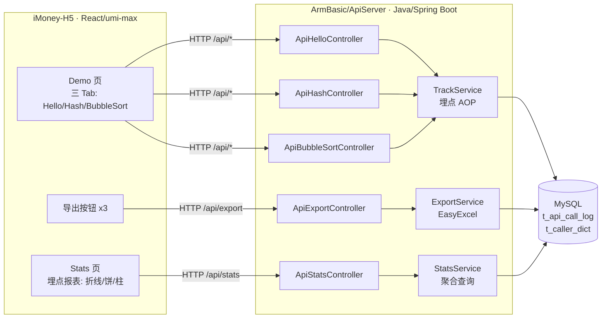
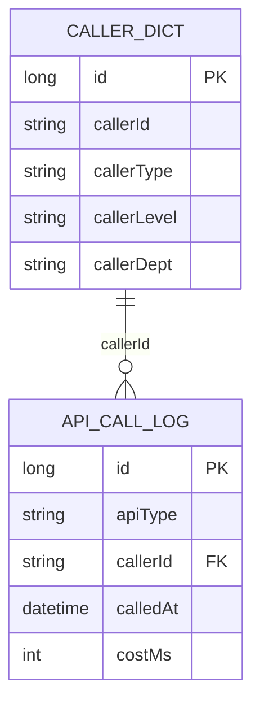
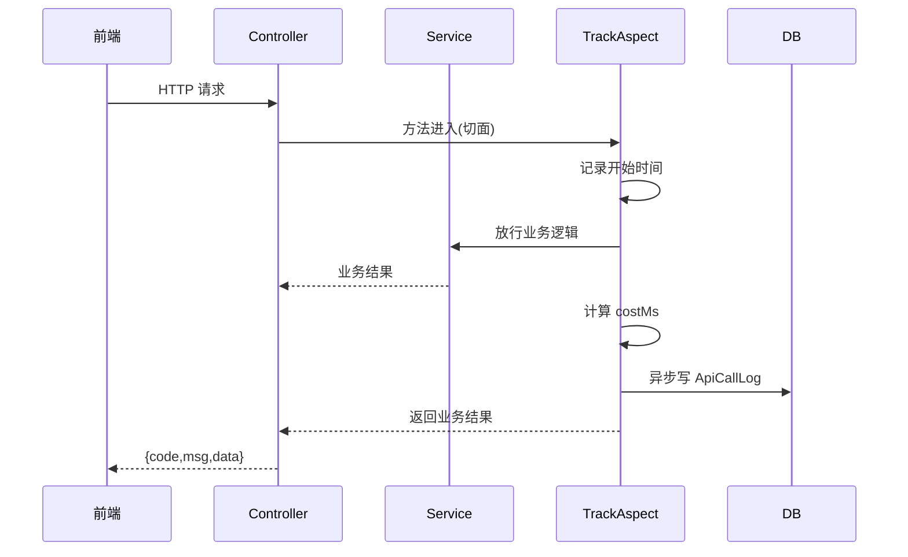
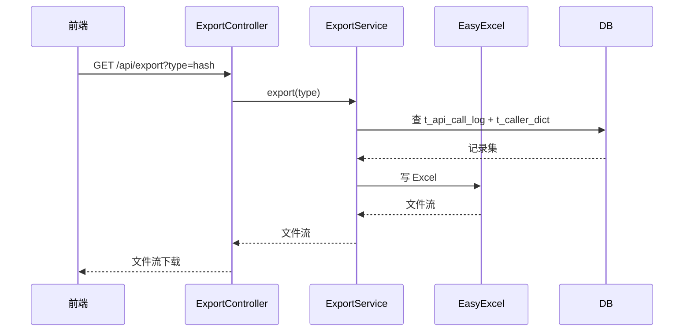
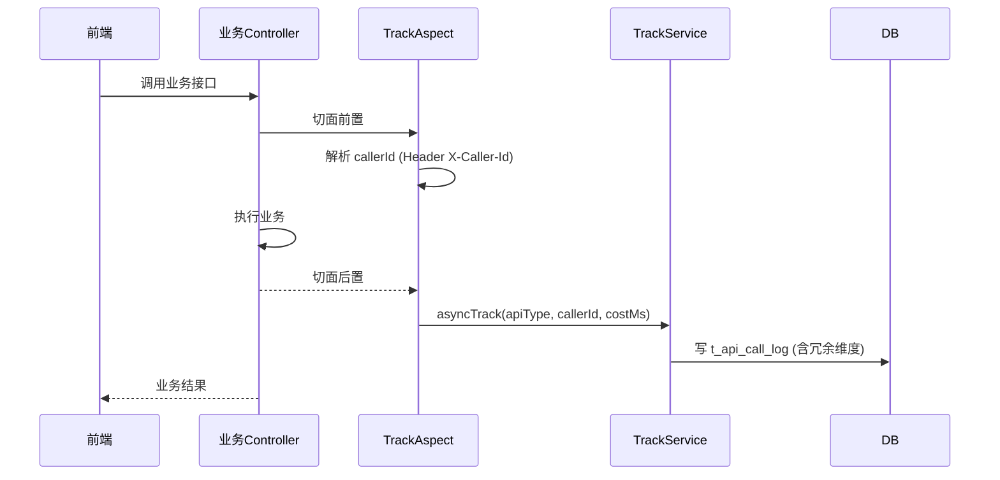

# 系统分析设计文档（系分设计）

- 任务节点：系分生成
- 采用技能：/dtazziboot-system-analysis-design
- 设计日期：2026-07-30
- 状态：全自动产出，未向用户提问、未等待确认
- 上游依赖：`.agents/DEV-966d/requirement-clarification.md`（需求澄清阶段产物，含跨仓现状、决策点 D1~D8、接口契约初稿）

---

## 一、需求背景与目标

### 1.1 需求原始描述

> 用 Java 分别写三个接口 helloworld、哈希算法以及冒泡排序；
> 前端新增一个页面，有三个 tab 分别展示不同的执行结果；
> 新增导出按钮，后台提供导出接口，支持导出各个页面的展示结果；
> 后端再做个埋点，获取调用次数和调用人，前端在当前页面上可视化出来一个报表查看调用情况
> （根据不同的维度：人员类型、人员层级、人员部门等），折线图以及饼图和柱状图不同展示形式。

### 1.2 用户澄清指令

> 后端采用指定仓库开发：ArmBasic

### 1.3 系统目标

| 目标 | 衡量标准 |
|------|---------|
| G1 后端三业务接口 | 用 Java（Spring Boot）实现 HelloWorld / 哈希(SHA-256) / 冒泡排序 三个 RESTful 接口，返回统一响应壳 |
| G2 前端三 Tab 展示 | iMoney-H5 新增 Demo 页，三 Tab 各触发一接口并展示结果 |
| G3 导出能力 | 后端提供 `/api/export` 接口，按 type 导出各 Tab 结果为 Excel(.xlsx)；前端每 Tab 配导出按钮 |
| G4 埋点 | 后端在三业务接口执行时同步写埋点记录（调用人、时间、耗时、维度） |
| G5 报表可视化 | 前端 Stats 页改造，按维度(类型/层级/部门) × 图表形态(折线/饼/柱) 可视化埋点调用情况 |

---

## 二、跨仓现状通览（只读探查结论）

| 仓库 | 物理路径 | 性质 | 技术栈 | 与需求相关性 |
|------|---------|------|--------|-------------|
| PH2498.github.io | `…/worktree/PH2498.github.io-master` | 静态博客站 | 纯静态 HTML/CSS/JS（GitHub Pages 风格，含年度归档） | ❌ 不适合 Tab 交互/动态图表 |
| **ArmBasic** ⭐后端 | `…/worktree/ArmBasic-main` | 语音/视觉 AI 项目 | **Python**（dashscope / SpeechRecognition / PyAudio / edge-tts / opencv / face_recognition），入口 `speech_ai.py`、`run_face_recognition.py` | ✅ 用户指定后端落点；但非 Java 工程 |
| iMoney-H5 | `…/worktree/iMoney-H5-main` | 移动端 H5 应用 | umi/max (React 18) + TS + antd-mobile + **ant-design-mobile-chart@^1.2.2** | ✅ 前端落地首选 |
| iMoney | `…/worktree/iMoney-main` | 小程序项目 | project.config.json + src（小程序体系） | ⚠️ 备选，非首选 |

### 2.1 ArmBasic 仓库结构（实测确认）

```
ArmBasic/
├─ AISpeechInteraction/   # Python：语音助手（麦克风/ASR/Qwen/TTS）
│  ├─ speech_ai.py
│  ├─ requirements.txt    # dashscope, SpeechRecognition, PyAudio, edge-tts, opencv-python
│  ├─ config_example.env
│  ├─ install_mac.sh
│  └─ static_audio/
├─ FaceRecognitionModule/  # Python：人脸识别（摄像头/face_recognition）
│  ├─ run_face_recognition.py
│  ├─ requirements.txt     # opencv-python, face_recognition, Pillow
│  └─ known_faces/
├─ README.md
└─ .gitignore
```

### 2.2 🚨 关键技术栈冲突与处理

- **冲突**：需求要求"用 Java 写后端"，但用户指定的 ArmBasic 是纯 **Python** 项目，无 Java/Maven/Gradle 工程结构与构建链。
- **处理（静默决策 D1）**：尊重用户指定，在 ArmBasic worktree 内**新建独立 Java 后端子模块目录** `ApiServer/`，承载 Spring Boot 服务，与既有 Python 模块目录隔离、并存。Python 模块不被改动（仅新增 Java 模块），满足向后兼容与最小风险。
- **残留风险**：将 Java 工程混入 Python 仓库偏离单仓库职责，但用户指令优先；若后续 CI 无 Java 工具链，Java 模块构建需独立环境，不影响 Python 模块运行。

### 2.3 iMoney-H5 有利条件（实测确认）

- `package.json` 已内置 `ant-design-mobile-chart@^1.2.2`（原生支持折线图 `Line` / 饼图 `Pie` / 柱状图 `Bar`，与需求图表形式完全吻合）
- `.umirc.ts` 路由规范：已有 `/home`、`/stats`、`/ai-assistant`、`/mine`，`npmClient: 'yarn'`，含 `request: {}`、`model: {}`、`initialState: {}` 插件
- `src/pages/Stats/index.tsx` 为 21 行空壳占位页（仅展示"统计/数据统计页面"文本 + MotionWrap + TabBar），可承载埋点报表
- `src/pages` 已有 AIAssistant / Home / Mine / Stats 四页，组件可复用（如 `@/components/base/MotionWrap`、`TabBar`）
- `mock/userAPI.ts` 可作 mock 契约参考

---

## 三、系统架构设计

### 3.1 架构总览



### 3.2 跨库调用链

前端 iMoney-H5（React） → HTTP（umi/max `request`，proxy 转发 `/api`） → 后端 ArmBasic/ApiServer（Java/Spring Boot） → MySQL

### 3.3 后端工程结构（新增，落点 `ArmBasic-main/ApiServer/`）

```
ApiServer/
├─ pom.xml                          # Maven，Spring Boot 3.x + Web + JDBC/EasyExcel
├─ src/main/java/com/mbdemo/apiserver/
│  ├─ ApiServerApplication.java     # 启动类
│  ├─ config/
│  │  └─ WebConfig.java             # CORS（跨域，前后端分离）
│  ├─ common/
│  │  ├─ Result.java                # 统一响应壳 {code, msg, data}
│  │  ├─ ResultCode.java            # 状态码枚举
│  │  └─ GlobalExceptionHandler.java
│  ├─ controller/
│  │  ├─ HelloController.java
│  │  ├─ HashController.java
│  │  ├─ BubbleSortController.java
│  │  ├─ ExportController.java
│  │  └─ StatsController.java
│  ├─ service/
│  │  ├─ HelloService.java
│  │  ├─ HashService.java
│  │  ├─ BubbleSortService.java
│  │  ├─ ExportService.java
│  │  ├─ StatsService.java
│  │  └─ TrackService.java          # 埋点写记录
│  ├─ aspect/
│  │  └─ TrackAspect.java            # AOP 切面，拦截三业务接口
│  ├─ entity/
│  │  ├─ ApiCallLog.java             # t_api_call_log 实体
│  │  └─ CallerDict.java            # t_caller_dict 实体
│  ├─ mapper/
│  │  ├─ ApiCallLogMapper.java
│  │  └─ CallerDictMapper.java
│  ├─ dto/
│  │  ├─ HashRequest.java
│  │  ├─ HashResponse.java
│  │  ├─ BubbleSortRequest.java
│  │  ├─ BubbleSortResponse.java
│  │  └─ StatsQuery.java
│  └─ enums/
│     ├─ ApiType.java                # HELLO/HASH/SORT
│     ├─ CallerType.java             # 内部/外部
│     ├─ Dimension.java              # TYPE/LEVEL/DEPT
│     └─ ChartType.java              # LINE/PIE/BAR
└─ src/main/resources/
   ├─ application.yml
   └─ mapper/                        # MyBatis XML（或用注解）
```

> 包名前缀 `com.mbdemo.apiserver`（mb = ArmBasic，避免与既有 Python 模块命名冲突）

### 3.4 前端工程结构（新增/改造，落点 `iMoney-H5-main/`）

```
src/
├─ pages/
│  ├─ Demo/                          # 【新增】三 Tab 页
│  │  ├─ index.tsx
│  │  ├─ index.less
│  │  ├─ components/
│  │  │  ├─ HelloTab.tsx
│  │  │  ├─ HashTab.tsx
│  │  │  └─ BubbleSortTab.tsx
│  │  └─ services.ts
│  └─ Stats/                         # 【改造】埋点报表
│     ├─ index.tsx                   # 由空壳 → 报表
│     ├─ index.less
│     ├─ components/
│     │  ├─ DimensionPicker.tsx       # 维度切换
│     │  ├─ ChartTypePicker.tsx       # 图表类型切换
│     │  └─ ReportCharts.tsx          # Line/Pie/Bar
│     └─ services.ts
├─ services/                          # 【新增】统一 API 封装
│  └─ api.ts                          # hello/hash/bubble-sort/export/stats
```

---

## 四、数据模型与存储（实体识别与关系）

> 聚焦实体识别与关系梳理，字段级详细定义见第六章功能模块设计。

### 4.1 实体清单表

| 实体 | 一句话说明 | 所属模块 | 与其他实体关系 |
|------|-----------|---------|--------------|
| ApiCallLog | API 调用埋点记录，每次三业务接口调用写入一条 | 埋点模块 | 关联 CallerDict.callerId（多对一） |
| CallerDict | 调用人字典，维护人员类型/层级/部门维度来源 | 埋点模块 | 被 ApiCallLog 引用（一对多） |

### 4.2 实体关系图



### 4.3 缓存/MQ 说明

- 无引入 Redis/MQ（本轮最小实现）；若后续埋点写入压力大，可异步化（MQ），当前不展开。
- 租户隔离：本轮为演示场景，未引入 tenant_id；若上生产需补充 `tenant_id` 维度过滤。

---

## 五、接口列表（总体接口清单）

> 仅梳理总体接口列表，详细定义见第六章。

| 编号 | 名称 | 方法 | 路径 | 所属模块 |
|------|------|------|------|---------|
| API-01 | HelloWorld | GET | `/api/hello` | 业务算法 |
| API-02 | 哈希算法 | POST | `/api/hash` | 业务算法 |
| API-03 | 冒泡排序 | POST | `/api/bubble-sort` | 业务算法 |
| API-04 | 导出 | GET | `/api/export` | 导出 |
| API-05 | 埋点查询 | GET | `/api/stats` | 埋点统计 |

> 接口形式：均为 OpenAPI（RESTful，`/api` 前缀）。增量模式：均为新增接口。

---

## 六、功能模块设计

### 6.0 全局约定

| 约定项 | 取值 |
|--------|------|
| 错误码格式 | `{MODULE}_{SEQ}`，如 `BIZ_001`、`EXPORT_001`、`TRACK_001` |
| 通用出参结构 | `{ code, msg, data }`（code=0 成功，非 0 失败；msg 即 message，归一化澄清文档 `message?`） |
| 响应字段命名 | camelCase（前后端一致） |
| 维度枚举 | `type` / `level` / `dept` |
| 图表枚举 | `line` / `pie` / `bar` |
| api_type 枚举 | `hello` / `hash` / `sort` |
| 时间维度 | 折线图按"日"，默认近 7 日 |

### 6.1 模块一：业务算法模块

#### 6.1.1 表结构

本模块无独立表（结果实时计算，不持久化）。埋点记录由埋点模块写入。

#### 6.1.2 枚举与常量

| 枚举 | 取值 | 说明 |
|------|------|------|
| ApiType | HELLO / HASH / SORT | 对应三业务接口，埋点 api_type 字段取小写 `hello`/`hash`/`sort` |

#### 6.1.3 接口详细设计

**API-01 HelloWorld**

| 项 | 内容 |
|----|------|
| Method/Path | `GET /api/hello` |
| 入参 | 无 |
| 出参 | `{ code:0, msg:"ok", data:{ message:"Hello, World!" } }` |
| 错误码 | `BIZ_001` 服务内部错误 |
| 请求示例 | `GET /api/hello` |
| 响应示例 | `{ "code":0, "msg":"ok", "data":{ "message":"Hello, World!" } }` |

**API-02 哈希算法**

| 项 | 内容 |
|----|------|
| Method/Path | `POST /api/hash` |
| 入参 | `algorithm: String`（默认 SHA-256），`input: String`（待哈希文本） |
| 出参 | `{ code:0, msg:"ok", data:{ algorithm, input, digest } }` |
| 错误码 | `BIZ_002` 入参为空；`BIZ_003` 不支持的算法 |
| 请求示例 | `{ "algorithm":"SHA-256", "input":"hello" }` |
| 响应示例 | `{ "code":0, "msg":"ok", "data":{ "algorithm":"SHA-256", "input":"hello", "digest":"2cf24dba5fb0a30e26e83b2ac5b9e29e1b161e5c1fa7425e73043362938b9824" } }` |

入参逐行：

| 参数 | 类型 | 必填 | 说明 |
|------|------|------|------|
| algorithm | String | 否 | 哈希算法，默认 SHA-256 |
| input | String | 是 | 待哈希字符串 |

出参逐行：

| 参数 | 类型 | 说明 |
|------|------|------|
| algorithm | String | 实际使用算法 |
| input | String | 原始输入 |
| digest | String | 十六进制摘要结果 |

**API-03 冒泡排序**

| 项 | 内容 |
|----|------|
| Method/Path | `POST /api/bubble-sort` |
| 入参 | `numbers: int[]`（待排序整数数组） |
| 出参 | `{ code:0, msg:"ok", data:{ original:[...], sorted:[...] } }` |
| 错误码 | `BIZ_004` 数组为空；`BIZ_005` 数组超长(>1000) |
| 请求示例 | `{ "numbers":[5,3,8,1] }` |
| 响应示例 | `{ "code":0, "msg":"ok", "data":{ "original":[5,3,8,1], "sorted":[1,3,5,8] } }` |

入参逐行：

| 参数 | 类型 | 必填 | 说明 |
|------|------|------|------|
| numbers | int[] | 是 | 待排序整数数组，长度 1~1000 |

出参逐行：

| 参数 | 类型 | 说明 |
|------|------|------|
| original | int[] | 原始数组 |
| sorted | int[] | 升序结果 |

#### 6.1.4 调用时序图



#### 6.1.5 业务规则表

| 规则编号 | 规则描述 |
|---------|---------|
| R-BIZ-1 | HelloWorld 固定返回 `Hello, World!` |
| R-BIZ-2 | 哈希默认 SHA-256；algorithm 传值需为支持的算法（当前仅 SHA-256） |
| R-BIZ-3 | 冒泡排序升序，不修改入参引用（返回新数组） |
| R-BIZ-4 | 三接口均经 TrackAspect 埋点（见 6.3） |

#### 6.1.6 异常场景表

| 场景 | 触发条件 | 处理 | 错误码 |
|------|---------|------|--------|
| 哈希入参空 | input 为 null/空串 | 返回失败 | BIZ_002 |
| 不支持的算法 | algorithm 非 SHA-256 | 返回失败 | BIZ_003 |
| 排序数组空 | numbers 为空 | 返回失败 | BIZ_004 |
| 数组超长 | numbers.length > 1000 | 返回失败 | BIZ_005 |

#### 6.1.7 技术选型方案对比（哈希实现）

| 方案 | 优点 | 缺点 |
|------|------|------|
| A. JDK `MessageDigest` | 零依赖，标准库 | API 略底层 |
| B. Apache Commons Codec | API 简洁 | 需引入依赖 |
| C. Spring DigestUtils | 封装好 | 依赖 spring-core |

**推荐 A**：零额外依赖，符合最小风险原则。理由：演示场景无需引入第三方库，JDK 内置足够。

### 6.2 模块二：导出模块

#### 6.2.1 接口详细设计

**API-04 导出**

| 项 | 内容 |
|----|------|
| Method/Path | `GET /api/export` |
| 入参 | `type: String`（hello/hash/sort） |
| 出参 | 文件流 `application/vnd.ms-excel`，Content-Disposition: `attachment; filename="<type>-<ts>.xlsx"` |
| 错误码 | `EXPORT_001` type 非法 |
| 请求示例 | `GET /api/export?type=hash` |

入参逐行：

| 参数 | 类型 | 必填 | 说明 |
|------|------|------|------|
| type | String | 是 | 导出类型，枚举 hello/hash/sort |

导出内容：

| type | 导出列 |
|------|--------|
| hello | 调用时间、调用人、结果消息 |
| hash | 调用时间、调用人、算法、输入、摘要 |
| sort | 调用时间、调用人、原始数组、排序结果 |

> 导出数据源：t_api_call_log 按 api_type 过滤 + 关联 t_caller_dict 取维度。

#### 6.2.2 调用时序图



#### 6.2.3 业务规则表

| 规则编号 | 规则描述 |
|---------|---------|
| R-EXP-1 | type 必须为 hello/hash/sort 之一 |
| R-EXP-2 | 导出范围为该 type 的全部埋点记录（可后续加时间范围） |
| R-EXP-3 | 文件名格式 `<type>-<timestamp>.xlsx` |

#### 6.2.4 异常场景表

| 场景 | 处理 | 错误码 |
|------|------|--------|
| type 非法 | 返回 JSON 错误（非文件流） | EXPORT_001 |
| 查询无数据 | 导出空表（含表头） | — |

#### 6.2.5 技术选型方案对比（Excel 生成）

| 方案 | 优点 | 缺点 |
|------|------|------|
| A. Apache POI | 功能全 | API 繁琐 |
| B. EasyExcel（阿里） | 流式写、内存友好、注解驱动 | 需引入依赖 |
| C. 手写 CSV | 零依赖 | 非 .xlsx，格式不符 |

**推荐 B**：EasyExcel，内存友好、注解驱动、业务常见。理由：澄清文档 D4 已定 Excel(.xlsx)，EasyExcel 适合结构化数据导出。

### 6.3 模块三：埋点模块

#### 6.3.1 表结构设计

**表 t_caller_dict（调用人字典）**

| 字段 | 类型 | 可空 | 默认 | 说明 |
|------|------|------|------|------|
| id | bigint | 否 | — | 主键，自增 |
| caller_id | varchar(64) | 否 | — | 调用人标识（唯一） |
| caller_name | varchar(64) | 是 | NULL | 调用人姓名 |
| caller_type | varchar(32) | 否 | — | 人员类型：内部员工/外部访客 |
| caller_level | varchar(32) | 否 | — | 人员层级：L1/L2/L3 等 |
| caller_dept | varchar(64) | 否 | — | 人员部门：研发部/产品部等 |
| created_at | datetime | 否 | CURRENT_TIMESTAMP | 创建时间 |
| updated_at | datetime | 否 | CURRENT_TIMESTAMP ON UPDATE CURRENT_TIMESTAMP | 更新时间 |

索引：`uk_caller_id` (caller_id 唯一索引)

**表 t_api_call_log（API 调用埋点记录）**

| 字段 | 类型 | 可空 | 默认 | 说明 |
|------|------|------|------|------|
| id | bigint | 否 | — | 主键，自增 |
| api_type | varchar(16) | 否 | — | 接口类型：hello/hash/sort |
| caller_id | varchar(64) | 否 | — | 调用人标识 |
| caller_type | varchar(32) | 否 | — | 人员类型（冗余，加速聚合） |
| caller_level | varchar(32) | 否 | — | 人员层级（冗余） |
| caller_dept | varchar(64) | 否 | — | 人员部门（冗余） |
| called_at | datetime | 否 | CURRENT_TIMESTAMP | 调用时间 |
| cost_ms | int | 否 | 0 | 接口耗时（毫秒） |
| result_code | int | 是 | NULL | 业务结果码（0 成功） |
| created_at | datetime | 否 | CURRENT_TIMESTAMP | 入库时间 |

索引：
- `idx_api_type` (api_type)
- `idx_called_at` (called_at)
- `idx_caller_type` (caller_type)
- `idx_caller_level` (caller_level)
- `idx_caller_dept` (caller_dept)

> 维度字段在 log 表冗余存储，避免 join 字典表做聚合查询，提升报表性能。

#### 6.3.2 枚举与常量

| 枚举 | 取值 | 说明 |
|------|------|------|
| CallerType | 内部员工/外部访客 | 人员类型维度 |
| CallerLevel | L1/L2/L3 | 人员层级维度 |
| Dimension | TYPE/LEVEL/DEPT | 报表维度，对应 caller_type/caller_level/caller_dept |
| ChartType | LINE/PIE/BAR | 报表图表形态 |

#### 6.3.3 接口详细设计

**API-05 埋点查询**

| 项 | 内容 |
|----|------|
| Method/Path | `GET /api/stats` |
| 入参 | `dimension`(type/level/dept)、`chart`(line/pie/bar)、`days`(默认7) |
| 出参 | 聚合数据，结构按 chart 形态适配 |
| 错误码 | `TRACK_001` dimension 非法；`TRACK_002` chart 非法 |

入参逐行：

| 参数 | 类型 | 必填 | 说明 |
|------|------|------|------|
| dimension | String | 是 | 维度：type/level/dept |
| chart | String | 是 | 图表：line/pie/bar |
| days | int | 否 | 天数，默认 7（仅 line 生效） |

出参（chart=pie/bar，如 dimension=dept, chart=pie）：

| 参数 | 类型 | 说明 |
|------|------|------|
| dimension | String | 当前维度 |
| chart | String | 当前图表形态 |
| items | List<{name,value}> | 各维度项及计数值 |

```json
{ "code":0, "msg":"ok", "data":{ "dimension":"dept", "chart":"pie",
  "items":[ { "name":"研发部", "value":128 }, { "name":"产品部", "value":64 } ] } }
```

出参（chart=line，如 dimension=type, days=7）：

| 参数 | 类型 | 说明 |
|------|------|------|
| dimension | String | 当前维度 |
| chart | String | line |
| xAxis | String[] | 日期轴（近 N 日，MM-DD） |
| series | List<{name,data:int[]}> | 按维度值分组的每日调用数 |

```json
{ "code":0, "msg":"ok", "data":{ "dimension":"type", "chart":"line",
  "xAxis":["07-24","07-25","07-26","07-27","07-28","07-29","07-30"],
  "series":[ { "name":"内部员工", "data":[10,12,8,15,20,18,22] },
             { "name":"外部访客", "data":[3,5,2,4,6,5,7] } ] } }
```

#### 6.3.4 调用时序图（业务接口埋点）



#### 6.3.5 业务规则表

| 规则编号 | 规则描述 |
|---------|---------|
| R-TRK-1 | 三业务接口经 TrackAspect 切面拦截，自动写埋点 |
| R-TRK-2 | callerId 来源：请求头 `X-Caller-Id`；若无则记 `anonymous` |
| R-TRK-3 | 维度字段从 t_caller_dict 按 callerId 关联取，冗余写入 log 表 |
| R-TRK-4 | 埋点写入异步（`@Async`），不影响业务接口响应耗时 |
| R-TRK-5 | 报表 line 按"日"维度聚合近 N 日；pie/bar 按维度值计数 |
| R-TRK-6 | 无真实登录态时，t_caller_dict 可预置 Mock 数据演示 |

#### 6.3.6 异常场景表

| 场景 | 处理 | 错误码 |
|------|------|--------|
| callerId 未匹配字典 | 仍写埋点，维度记 `unknown` | — |
| 埋点写入失败 | 仅记日志，不影响业务 | — |
| dimension 非法 | 返回失败 | TRACK_001 |
| chart 非法 | 返回失败 | TRACK_002 |
| days <= 0 | 默认 7 | — |

#### 6.3.7 技术选型方案对比（埋点实现）

| 方案 | 优点 | 缺点 |
|------|------|------|
| A. AOP 切面 + @Async 异步 | 业务无侵入、解耦 | 切面配置略复杂 |
| B. 各 Controller 显式调用 | 简单直接 | 侵入业务、易遗漏 |
| C. Filter/Interceptor | 全局拦截 | 难精确控制业务粒度 |

**推荐 A**：AOP 切面 + @Async。理由：三业务接口需统一埋点，AOP 无侵入且可复用，@Async 保证不阻塞业务响应。

### 6.4 模块四：前端模块（iMoney-H5）

> 系分阶段仅做模块设计，不写代码（阶段门控）。

#### 6.4.1 路由与页面

- 新增路由 `src/pages/Demo`，路径 `/demo`，三 Tab：`Hello` / `Hash` / `BubbleSort`，各 Tab 触发对应接口并展示执行结果
- 改造 `src/pages/Stats`（路径已存在 `/stats`）：由空壳 → 承载埋点报表（折线/饼/柱），维度切换 + 图表类型切换
- 导出按钮：Demo 页三 Tab 各配一个"导出当前结果"按钮，调用 `/api/export?type=...`

`.umirc.ts` 路由增量（在 `/stats` 与 `/ai-assistant` 间插入）：

```ts
{ name: '演示', path: '/demo', component: './Demo' },
```

#### 6.4.2 图表选型（复用 ant-design-mobile-chart）

| 图表 | 组件 | 用途 |
|------|------|------|
| 折线图 | `Line` | 调用趋势，按日 |
| 饼图 | `Pie` | 维度占比 |
| 柱状图 | `Bar` | 维度对比 |

#### 6.4.3 数据流

- umi/max `useRequest` / `request` 调后端
- `.umirc.ts` 增配 proxy 转发 `/api` → 后端端口（如 `http://localhost:8080`）

proxy 增量（`.umirc.ts`）：

```ts
proxy: {
  '/api': {
    target: 'http://localhost:8080',
    changeOrigin: true,
  },
},
```

#### 6.4.4 前端接口调用清单

| 接口 | 前端调用点 | 方式 |
|------|-----------|------|
| API-01 hello | Demo/HelloTab | `useRequest` GET |
| API-02 hash | Demo/HashTab | `useRequest` POST |
| API-03 bubble-sort | Demo/BubbleSortTab | `useRequest` POST |
| API-04 export | Demo 各 Tab 导出按钮 | 浏览器下载 GET |
| API-05 stats | Stats 页 ReportCharts | `useRequest` GET |

---

## 七、跨库对齐点（契约兼容性检查）

| 对齐点 | 约定 | 前端(iMoney-H5) | 后端(ArmBasic/ApiServer) | 兼容性 |
|--------|------|----------------|------------------------|--------|
| 响应壳 | `{code,msg,data}` | 按 msg 解析 | 返回 msg | ✅ 一致 |
| 字段命名 | camelCase | camelCase | camelCase | ✅ 一致 |
| 维度枚举 | type/level/dept | 维度 Picker 选项 | Dimension 枚举 | ✅ 一致 |
| 图表枚举 | line/pie/bar | 图表 Picker 选项 | ChartType 枚举 | ✅ 一致 |
| api_type 枚举 | hello/hash/sort | 导出 type 参数 | ApiType 枚举 | ✅ 一致 |
| 导出下载 | 浏览器解析 Content-Disposition | 直接 window.location 下载 | 设置响应头 | ✅ 一致 |
| 跨域 | CORS 或 proxy | proxy 转发 /api | WebConfig CORS | ✅ 一致 |
| 向后兼容 | 仅新增 | 仅新增页面/路由，不改既有路由 | 仅新增 Java 模块，不改 Python 模块 | ✅ 一致 |

**跨库调用链**：前端 iMoney-H5（React）→ HTTP → 后端 ArmBasic/ApiServer（Java/Spring Boot）→ MySQL

---

## 八、风险与假设

### 8.1 假设

- A1：用户体系维度字段（类型/层级/部门）可由后端字典表 `t_caller_dict` 静态维护；若无真实登录态，可预置 Mock 数据演示
- A2：ArmBasic worktree 内可引入 Java 构建链（JDK 17 + Maven）；若 CI 环境无 Java，Python 模块运行不受影响（`ApiServer/` 子目录独立）
- A3：MySQL 可用（开发环境可降级为 H2 内嵌库，需在 application.yml 配 profile）
- A4：callerId 经请求头 `X-Caller-Id` 传入（演示态无 OAuth，后续可接登录态）

### 8.2 风险

| 编号 | 风险 | 影响 | 缓解 |
|------|------|------|------|
| R1 | 在 Python 仓库内混入 Java 后端，偏离单仓库职责 | 仓库职责混乱 | 遵循用户指定落点 D1；ApiServer 子目录隔离 |
| R2 | CI 无 Java 工具链，Java 模块无法构建 | 后端交付受阻 | Python 模块不受影响；Java 模块独立环境构建 |
| R3 | iMoney 小程序仓库与 iMoney-H5 并存 | 前端覆盖范围不确定 | 本轮默认仅 H5；需后续确认是否覆盖小程序端 |
| R4 | 无真实登录态，埋点维度数据需 Mock | 报表数据真实性 | 预置 t_caller_dict Mock 数据 |
| R5 | 埋点写库阻塞业务接口 | 接口耗时增加 | @Async 异步写，降级仅记日志 |

---

## 九、产物清点（本轮，系分生成阶段）

| 产物 | 路径 | 状态 |
|------|------|------|
| 系分设计文档 | `.agents/system.changes/design.md` | ✅ 已生成 |

- 未修改任何 `.ts` / `.java` / `.py` / `.xml` / `.yaml` 代码文件（符合系分生成阶段门控）
- 代码落地在后续"编码实现"阶段执行

---

## 十、修订记录

| 版本 | 日期 | 修订内容 |
|------|------|---------|
| v1 | 2026-07-30 | 初版系分设计，承接需求澄清文档 v2，按 dtazziboot-system-analysis-design 范式产出（数据模型/接口列表/功能模块设计/跨库对齐/风险假设） |
