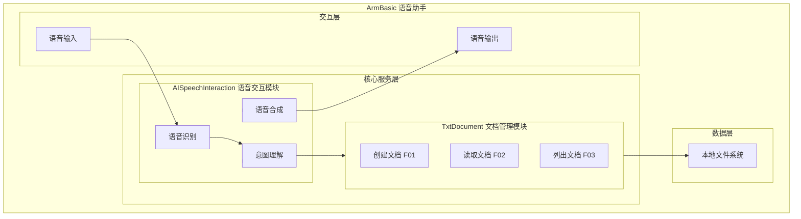
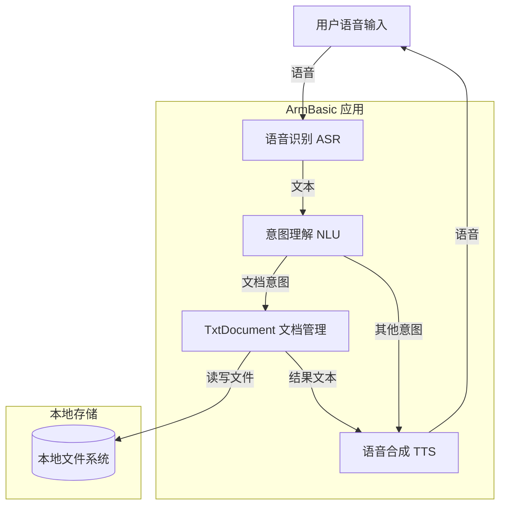
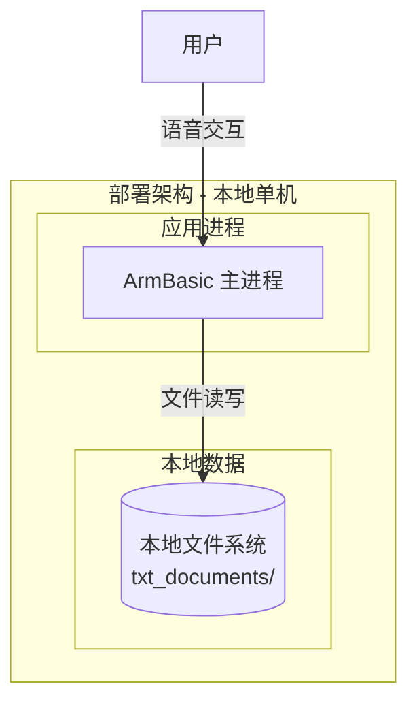
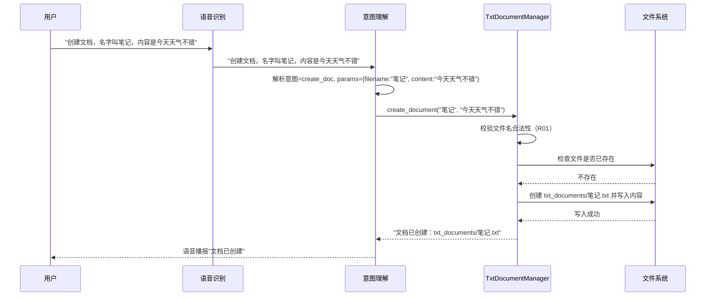
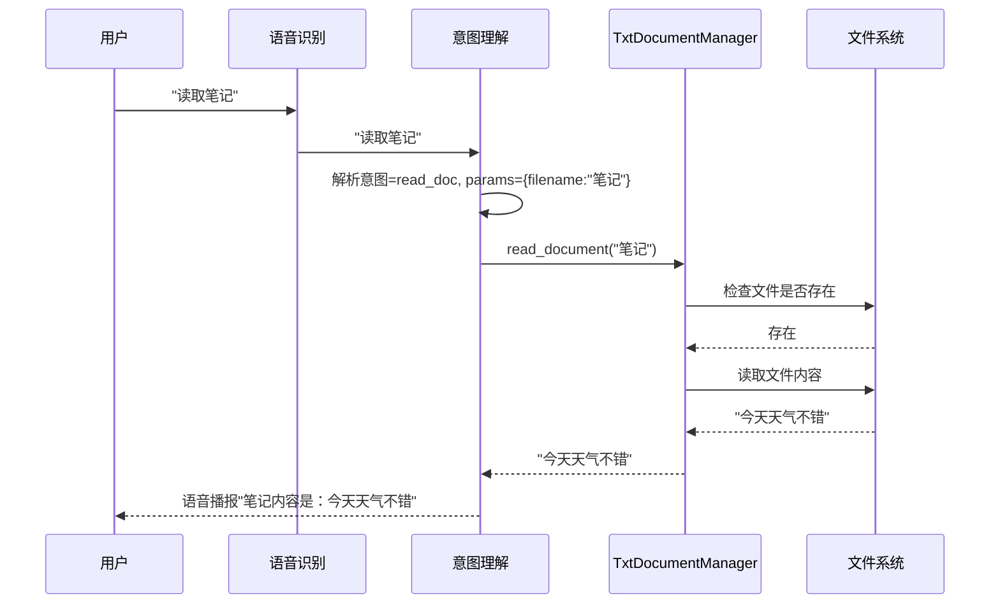
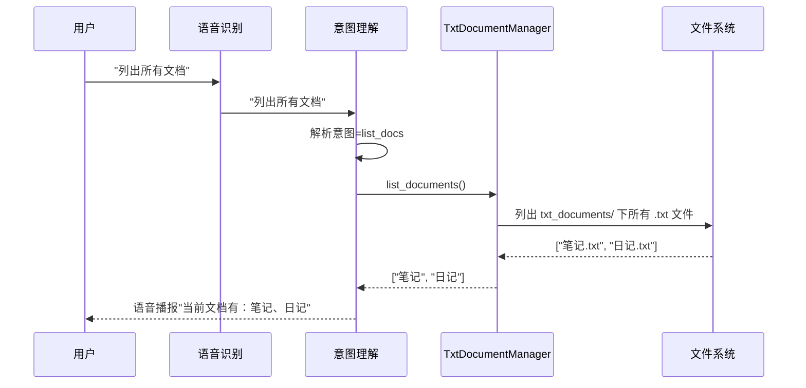

> **文档元信息**
>
> | 项目 | 内容 |
> |------|------|
> | 文档版本 | v1.0 |
> | 作者 | DTCoder |
> | 创建日期 | 2026-08-20 |
> | 需求来源 | 用户需求："实现一个简单的txt文档" |
> | 评审状态 | 待评审 |

# TxtDocument 简单txt文档 系分设计

## 1. 需求与范围

### 背景与目标
当前 ArmBasic 项目为本地语音助手应用，支持语音交互与人脸识别。需新增「简单txt文档」功能，让用户可通过语音命令创建、保存和读取文本文件。

### 核心功能
- 创建新的txt文档并写入内容
- 读取已有txt文档内容
- 列出已有txt文档

### 约束与非功能要求
- 本地文件存储，无需网络
- 文件存储于本地指定目录
- 操作需简单、快速

### 排除范围
- 不涉及富文本格式（仅纯文本）
- 不涉及云端同步
- 不涉及文档加密/权限控制
- 不涉及多用户协作

### 需求功能清单与优先级

| 编号 | 功能点 | 优先级 | 原始描述 | 备注 |
|------|--------|--------|----------|------|
| F01 | 创建txt文档 | P0 | 实现一个简单的txt文档 | 新建txt文件并写入内容 |
| F02 | 读取txt文档 | P1 | 实现一个简单的txt文档 | 读取已有txt文件内容 |
| F03 | 列出文档列表 | P2 | 实现一个简单的txt文档 | 列出指定目录下所有txt文件 |

### 假设与待确认项

| 编号 | 假设/待确认内容 | 当前假设 | 确认状态 |
|------|-----------------|----------|----------|
| A01 | 需求未指定具体功能范围 | 假设为完整的txt文档CRUD基础功能（创建、读取、列表），基于"实现"一词的最自然解释 | 待确认 |
| A02 | 未指定文档存储路径 | 假设存储于项目根目录下的 `txt_documents/` 目录 | 待确认 |
| A03 | 未指定交互方式 | 假设通过语音命令触发（与现有语音助手集成），如"创建文档"、"读取文档" | 待确认 |
| A04 | 未指定技术栈 | 假设使用Python（与现有项目技术栈一致） | 待确认 |

---

## 2. 架构与模块

### 功能架构

- 交互层说明：语音输入/输出，与现有架构一致
- 核心服务层说明：新增 TxtDocument 文档管理模块，负责文档的创建、读取和列表操作；与现有 AISpeechInteraction 模块通过意图理解（NLU）进行集成
- 数据层说明：直接操作本地文件系统，无需数据库

**模块清单**

| 模块 | 职责 | 依赖 |
|------|------|------|
| AISpeechInteraction | 语音识别、意图理解、语音合成（现有模块） | 无 |
| TxtDocument | txt文档的创建、读取、列表管理（新增模块） | AISpeechInteraction（通过意图路由） |

### 应用集成架构

**集成关系说明：**

| 调用方 | 被调用方 | 协议 | 接口类型 | 说明 |
|--------|----------|------|----------|------|
| 语音输入 | ASR | 本地调用 | Python函数 | Whisper/Google 语音识别 |
| ASR | NLU | 本地调用 | Python函数 | 意图关键词匹配 |
| NLU | TxtDocument | 本地调用 | Python函数 | 文档操作意图路由 |
| TxtDocument | 文件系统 | 文件IO | Python os/file | 本地文件读写 |

### 部署架构

**部署说明：**
- 本应用为本地桌面级应用，无需负载均衡
- 应用层：单进程运行于 macOS
- 数据层：本地文件系统，无需数据库
- 无单点问题（本地应用，非服务化部署）

---

## 3. 数据模型与存储

### 实体清单

| 实体名称 | 实体说明 | 所属模块 | 与其他实体的关系 |
|----------|----------|----------|-----------------|
| TxtDocument | 表示一个txt文档文件 | TxtDocument | 独立实体，无关联 |

### 实体关系图

**模型说明：**
- 本功能仅涉及txt文件，不涉及数据库存储
- 文件以操作系统文件形式存储于本地文件系统
- 文件元信息（文件名、大小、修改时间）由文件系统自身管理
- 无缓存/MQ需求

### 存储方案
- 存储类型：本地文件系统
- 存储路径：`<项目根目录>/txt_documents/`
- 文件格式：纯文本 `.txt`
- 文件命名：用户指定文件名（自动追加 `.txt` 后缀）

---

## 4. 接口设计

### 4.1 oneapi（Web控制台接口）
本项不适用，原因：ArmBasic 为本地桌面语音助手应用，无 Web 控制台接口。

### 4.2 OpenAPI（对外接口）
本项不适用，原因：ArmBasic 为本地应用，不对外暴露 API。

### 4.3 内部接口（Service 层）

| 编号 | 接口名称 | 类 | 方法签名 |
|------|----------|------|----------|
| S01 | 创建文档 | TxtDocumentManager | create_document(filename: str, content: str) -> str |
| S02 | 读取文档 | TxtDocumentManager | read_document(filename: str) -> str |
| S03 | 列出文档 | TxtDocumentManager | list_documents() -> list[str] |

### 4.4 集成接口（Integration 层）

| 编号 | 接口名称 | 类 | 方法签名 | 说明 |
|------|----------|------|----------|------|
| I01 | 文档意图处理 | NLU Router | handle_document_intent(intent: str, params: dict) -> str | 由 NLU 层路由到 TxtDocumentManager |

---

## 5. 功能模块设计

### 5.1 TxtDocument 模块

#### 5.1.1 表结构设计
本项不适用，原因：本模块使用本地文件系统存储，不涉及数据库表。

#### 5.1.2 全局约定

**错误码格式：** 采用 `{MODULE}_{SEQ}` 格式，模块前缀 `TXT`。

| 错误码 | 说明 |
|--------|------|
| TXT_001 | 文件名无效（包含非法字符或为空） |
| TXT_002 | 文件已存在 |
| TXT_003 | 文件不存在 |
| TXT_004 | 文件读写失败 |
| TXT_005 | 内容为空 |

**通用出参结构：** 内部函数返回 Python 原生类型（str / list / None），异常通过 raise 抛出。

#### 5.1.3 接口详细设计

##### S01 创建文档

- **方法签名**: `create_document(filename: str, content: str) -> str`
- **描述**: 在 `txt_documents/` 目录下创建新的txt文件并写入内容
- **入参**:

| 参数名称 | 类型 | 是否必填 | 描述 |
|----------|------|----------|------|
| filename | str | 是 | 文件名（不含路径，自动追加 .txt 后缀） |
| content | str | 是 | 文件内容 |

- **出参**:

| 参数名称 | 类型 | 描述 |
|----------|------|------|
| return | str | 创建成功时返回完整文件路径 |

- **错误码**:

| 错误码 | 说明 |
|--------|------|
| TXT_001 | 文件名无效 |
| TXT_002 | 文件已存在 |
| TXT_004 | 文件写入失败 |
| TXT_005 | 内容为空 |

- **业务规则**: 文件名仅允许字母、数字、下划线、中文；文件已存在时返回错误不覆盖

##### S02 读取文档

- **方法签名**: `read_document(filename: str) -> str`
- **描述**: 读取 `txt_documents/` 目录下指定txt文件的内容
- **入参**:

| 参数名称 | 类型 | 是否必填 | 描述 |
|----------|------|----------|------|
| filename | str | 是 | 文件名（不含路径，自动追加 .txt 后缀） |

- **出参**:

| 参数名称 | 类型 | 描述 |
|----------|------|------|
| return | str | 文件内容字符串 |

- **错误码**:

| 错误码 | 说明 |
|--------|------|
| TXT_001 | 文件名无效 |
| TXT_003 | 文件不存在 |
| TXT_004 | 文件读取失败 |

##### S03 列出文档

- **方法签名**: `list_documents() -> list[str]`
- **描述**: 列出 `txt_documents/` 目录下所有 .txt 文件
- **入参**: 无

- **出参**:

| 参数名称 | 类型 | 描述 |
|----------|------|------|
| return | list[str] | 文件名列表（不含 .txt 后缀） |

- **错误码**:

| 错误码 | 说明 |
|--------|------|
| TXT_004 | 目录读取失败 |

#### 5.1.4 子功能详细设计

##### 5.1.4.1 创建文档（F01）

- 处理时序图

**业务规则：**

| 规则编号 | 规则描述 | 校验时机 | 不满足时的处理 |
|----------|----------|----------|--------------|
| R01 | 文件名不能为空，不能包含路径分隔符（/、\） | 创建时 | 返回错误 TXT_001，提示"文件名无效" |
| R02 | 文件名不能与已有文件重名 | 创建时 | 返回错误 TXT_002，提示"文件已存在" |
| R03 | 内容不能为空字符串 | 创建时 | 返回错误 TXT_005，提示"内容不能为空" |

**异常场景：**

| 异常场景 | 处理方式 |
|----------|----------|
| 文件系统写入权限不足 | 捕获 IOError，返回 TXT_004 |
| 磁盘空间不足 | 捕获 IOError，返回 TXT_004 |
| 目标目录不存在 | 自动创建 txt_documents/ 目录 |

**并发控制：**
- 无并发风险，原因：本地单用户语音助手应用，不存在并发写入场景。

##### 5.1.4.2 读取文档（F02）

- 处理时序图

**业务规则：**

| 规则编号 | 规则描述 | 校验时机 | 不满足时的处理 |
|----------|----------|----------|--------------|
| R04 | 文件名不能为空，不能包含路径分隔符 | 读取时 | 返回错误 TXT_001 |
| R05 | 目标文件必须存在 | 读取时 | 返回错误 TXT_003，提示"文件不存在" |

**异常场景：**

| 异常场景 | 处理方式 |
|----------|----------|
| 文件读取权限不足 | 捕获 IOError，返回 TXT_004 |
| 文件编码非UTF-8 | 捕获 UnicodeDecodeError，尝试系统默认编码回退 |

##### 5.1.4.3 列出文档（F03）

- 处理时序图

**业务规则：**

| 规则编号 | 规则描述 | 校验时机 | 不满足时的处理 |
|----------|----------|----------|--------------|
| R06 | 目录不存在时视为空列表 | 列表时 | 返回空列表 [] |

**异常场景：**

| 异常场景 | 处理方式 |
|----------|----------|
| 目录读取权限不足 | 捕获 OSError，返回空列表并记录日志 |

**并发控制：**
- 无并发风险，原因：本地单用户应用，仅读取操作。

#### 5.1.5 技术选型方案对比

| 方案 | 描述 | 优点 | 缺点 |
|------|------|------|------|
| 方案A：纯文件IO | 使用 Python 内置 os/file 直接操作文件系统 | 零依赖、简单直接、与本项目技术栈一致 | 无结构化查询能力 |
| 方案B：SQLite | 使用 SQLite 存储文档元数据和内容 | 支持结构化查询 | 引入额外依赖、过度设计 |
| 方案C：配置文件格式 | 使用 JSON/YAML 配置文件管理文档 | 结构化 | 不符合"txt文档"需求 |

**推荐方案：方案A（纯文件IO）**，理由：需求为"简单的txt文档"，纯文件IO是最小化实现，零额外依赖，与现有Python项目技术栈完全一致。

#### 5.1.6 模块自检

**完备性对账表：**

| 检查项 | 状态 |
|--------|------|
| F01 创建文档 | ✅ 已设计 |
| F02 读取文档 | ✅ 已设计 |
| F03 列出文档 | ✅ 已设计 |
| 所有接口已定义 | ✅ S01-S03 已定义 |
| 错误码覆盖 | ✅ TXT_001~005 |
| 异常场景覆盖 | ✅ 已覆盖 |

**过度设计检查：**

| 检查项 | 结论 |
|--------|------|
| 是否引入数据库 | 否，仅文件IO ✅ |
| 是否有不必要的抽象层 | 否，直接读写 ✅ |
| 是否有冗余功能 | 否，仅CRUD基础操作 ✅ |

---

## 6. 非功能性需求设计

### 6.1 高可用性
本项不适用，原因：ArmBasic 为本地桌面单进程应用，不涉及服务高可用。核心功能（文档读写）依赖本地文件系统，文件系统不可用时操作系统层面已不可用，应用无需额外高可用设计。

### 6.2 可扩展性
- 水平扩展：本项不适用，本地单用户应用无需水平扩展
- 架构扩展性：TxtDocumentManager 作为独立模块，接口清晰，未来可替换为云存储后端（如 iCloud/OneDrive）而不影响上层调用方

### 6.3 稳定性/可靠性
- 文件写入：采用原子写入（先写临时文件，成功后再 rename），避免写入过程中断导致文件损坏
- 目录自动创建：首次使用时自动创建 `txt_documents/` 目录，无需手动初始化
- 编码：统一使用 UTF-8 编码，确保中文内容正确存储

### 6.4 安全性设计
#### 6.4.1 账户系统方案
本项不适用，原因：本地单用户应用，无账户系统。

#### 6.4.2 授权&访问控制
##### 6.4.2.1 是否实现水平权限检查
本项不适用，原因：本地单用户，无多租户场景。

##### 6.4.2.2 是否实现垂直权限检查
本项不适用，原因：本地单用户，无角色权限场景。

##### 6.4.2.3 是否检查登录态
本项不适用，原因：本地桌面应用，无登录态需求。

#### 6.4.3 数据防护方案
##### 6.4.3.1 是否对敏感数据加密存储
本项不适用，原因：txt文档为普通文本，不涉及身份证、人脸、银行卡等敏感信息。如用户后续写入敏感内容，由用户自行负责。

##### 6.4.3.2 是否对敏感数据展示进行脱敏
本项不适用，原因：本地应用直接展示原始内容，不涉及脱敏。

### 6.5 监控/统计/日志/告警
- 关键操作日志：文档创建/读取/列表操作输出 info 级别日志
- 异常日志：文件操作失败时输出 error 级别日志，包含文件名和错误详情
- 告警：本项不适用，本地应用无需远程告警

---

## 7. 变更三板斧

### 7.1 可监控
- 监控埋点：文档创建/读取/列表操作记录日志，包含操作类型、文件名、操作结果（成功/失败）、耗时
- 关键指标：文档操作成功率、失败原因分布
- 实现方式：Python logging 模块，输出到控制台和日志文件

### 7.2 可灰度
本项不适用，原因：本地桌面应用，通过代码版本发布，无灰度引流机制。如需灰度，可通过功能开关（feature flag）控制 TxtDocument 模块是否启用，但鉴于需求简单，不推荐增加复杂度。

### 7.3 可应急
- 开关控制：可通过配置文件（如 `.env`）中的 `ENABLE_TXT_DOCUMENT=true/false` 开关快速禁用文档功能
- 回滚方案：发布包回滚即可，TxtDocument 模块为纯新增，不影响现有语音交互和人脸识别功能
- 上下游兼容性：新增模块，无上下游依赖变更风险
- 数据安全：回滚不会删除已创建的 txt 文件，用户数据不受影响